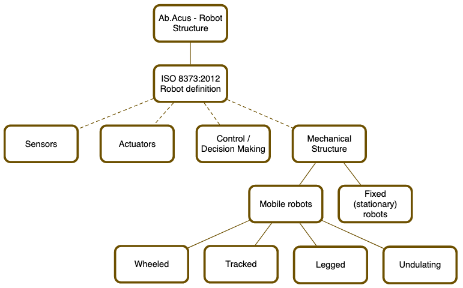
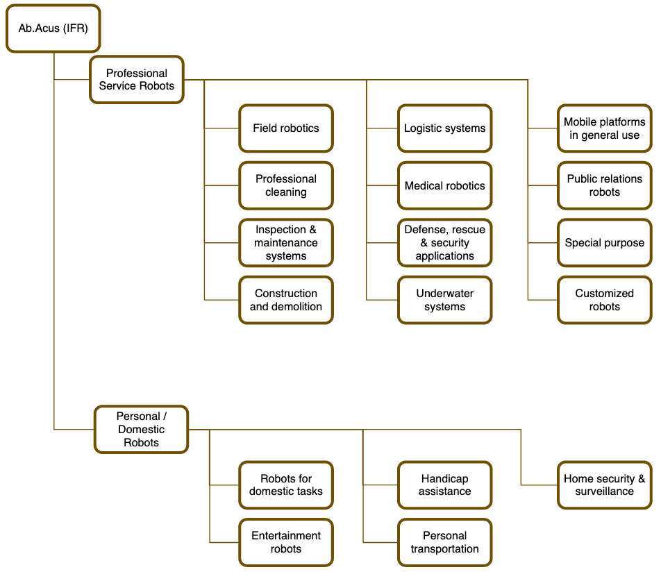

<!-- _class: titlepage -->

Introducción

Robótica

Alberto Díaz y Raúl Lara

Curso 2022/2023

Departamento de Sistemas Informáticos

---

# Robot

Según la RAE:

1. Máquina o ingenio electrónico programable que es capaz de manipular objetos y realizar diversas operaciones
2. Robot que imita la figura y los movimientos de un ser animado
3. Persona que actúa de manera mecánica o sin emociones
4. Programa que explora automáticamente la red para encontrar información

Según el diccionario Collins: <i>"A robot is a machine which is programmed to move and perform certain tasks automatically"</i>

---

# Etimología

**Robot** viene del eslavo <i>robota</i> (<i>trabajo</i>, con cierto sentido de <i>servidumbre</i>)

- Apareció por primera vez en la obra R.U.R. (Rossumovi univerzální roboti)1
- Escrita en 1920 por Karel Čapek y estrenada en 1921
- La idea detrás del término se le atribuye a su hermano, Josef Čapek

**Robótica** fue utilizada primero por Isaak Asimov, en 1941

- No fue consciente de que estaba bautizando una nueva rama de la ciencia
- Asumió que "robótica" se refería al trabajo que se realiza con los robots
- Según él este se propuso término en el relato <i>Círculo vicioso</i>2  (<i>Runaround</i>) en 1942, aunque en realidad el relato <i>¡Embustero!</i>3  (<i>Liar!</i>) fue anterior

> 1 <https://es.wikipedia.org/wiki/R.U.R._(Robots_Universales_Rossum)>
> 2 <https://es.wikipedia.org/wiki/C%C3%ADrculo_vicioso_(cuento)>
> 3 <https://es.wikipedia.org/wiki/%C2%A1Embustero!>

---

# Las Tres Leyes y la Ley Cero

1. Un robot no hará daño a un ser humano ni, por inacción, permitirá que un ser humano sufra daño
1. Un robot debe cumplir las órdenes dadas por los seres humanos, a excepción de aquellas que entren en conflicto con la primera ley
1. Un robot debe proteger su propia existencia en la medida en que esta protección no entre en conflicto con la primera o con la segunda ley

Tras múltiples relatos, añadió una Ley Cero para preceder a las demás

1. Un robot no puede dañar a la humanidad o, por inacción, permitir que la humanidad sufra daños.

<!-- ¿Por qué son interesantes?

- Plantean un código moral para robots autónomos con capacidad consciente
- Ofrecen un punto de vista en el análisis de la ética -->

---

# Inteligencia artificial y robótica

Entre otros objetivos, la IA trata de crear máquinas que piensan

- Pensar requiere, entre otras cosas, percibir y adquirir conocimiento

Cómo se adquiere el conocimiento

- Reconocimiento de voz
- Inferencias
- Visión artificial

El conocimiento se almacena en memoria de forma simbólica o subsimbólica

---

---

## ¿Es necesario que sea una máquina autónoma?

---

---

## ¿Es necesario que actúe sobre el mundo físico?

---

---

## Entonces, ¿qué define a un robot?

---

# Componentes esenciales de un robot

Para el propósito de este curso podemos decir que hay tres componentes en un robot esenciales:

- **Sensores**: para percibir tanto el entorno que le rodea como su propio estado
- **Controladores**: para analizar el estado actual y tomar decisiones
- **Actuadores**: para manipular y realizar acciones sobre el entorno

---

# Sensores

**Percepción**: Un robot **percibe el mundo** que le rodea a través de sensores, normalmente análogos a los sentidos del ser humano:

- Vista: Cámaras, radares LiDAR, ...
- Oído: Microfonos
- Tacto: Sensor de temperatura, presión, ...
- Gusto y olfato: Sensores químicos

Sin embargo, hay otros sensores que no tienen homólogo humano:

- GPS para identificar la posición exacta en el globo
- Barómetro para determinar la altitud
- Compás para reconocer la orientación

---

# Controladores

**Toma de decisiones**: En función de los datos de los sensores (y a veces su estado interno) un robot decide **cómo acometer una tarea**

- Pueden ser tan simples como responder sí o no a una cuestión
- O tan complejas como determinar la ruta a seguir por un entorno desconocido

En la práctica, el proceso de toma de decisiones en robótica es complejo

Además, por el camino se pueden usar técnicas sofisticadas, como análisis de imágen o algoritmos de <i>path planning</i>

---

# Actuadores

**Actuación**: Un robot **actúa** sobre el entorno una vez ha decidido cómo

Pueden tomar diversas formas para muchos propósitos diferentes:

- Ir de un punto a otro
- Acelerar o frenar
- Realizar nuevas medidas del entorno con sensores
- Comunicarse con humanos u otros robots
- Los motores y actuadores pueden hacer girar las ruedas, activar articulaciones o rotar las hélices de un robot
- Encender un escáner para tomar una medida
- Emitir luces o sonidos

---

<!--
   _class: transition
-->

# Evolución de los robots

---

# Autómatas

Máquinas que imitan la figura y los movimientos de un ser animado

- Son relativamente autónomas
- Siguen automáticamente una secuencia de operaciones
- Responden a una o más instrucciones determinadas

Se tienen registros desde el antiguo Egipto (Máscara de Anubis de mandíbula móvil) hasta nuestros días (Animatrónics)

---

<video controls width=100% src="https://upload.wikimedia.org/wikipedia/commons/1/1a/Cima_automaton.ogv" poster="https://upload.wikimedia.org/wikipedia/commons/thumb/1/1a/Cima_automaton.ogv/1280px--Cima_automaton.ogv.jpg"></video>

---

# Principios del siglo XX

En 1912, **Leonardo Torres y Quevedo** construye la primera máquina autónoma capaz de jugar al ajedrez: *El Ajedrecista*.

Intenta hacer mate en un escenario reducido de final de partida.

Capaz de detectar movimientos incorrectos del oponente señalándolos con una bombilla.

---

<video controls width=100% src="https://drive.upm.es/s/V5temgyKuoHbvq9/download"></video>

---

# Robots industriales

Empiezan a desarrollarse en los 1930.

Articulados a imagen y semejanza de brazos humanos.

Inicialmente replicando el movimiento del operador.

Entran en juego la automatización y el **control numérico**.

---

<video controls width=100% src="https://drive.upm.es/s/QdVyi48T8sYgj81/download"></video>

---

# Década de los 70: autonomía y control

La industria armamentística se convierte en la punta de lanza de la robótica, creando munición autónoma 'fire-and-forget'.

Se crea el primer robot capaz de caminar como un humano: **WABOT-1**. Incluía síntesis de voz, manipulación de objetos y entendía órdenes habladas en japonés.

---

<video controls width=100% src="https://drive.upm.es/s/pJvoVnJPhYhRS6l/download"></video>

---

# 80s/90s: humanoides, sistemas inteligentes y robótica de consumo

La tendencia de humanizar a los robots se dispara en esta época.

Honda desarrolla dos versiones de su robot humanoide inteligente: P2 y P3.

Sony presenta su mascota robot, **AIBO**, capaz de seguir una pelota gracias a su módulo de visión por computador. Este robot está dotado de inteligencia artificial para reconocer órdenes, establecer una relación empática con el propietario, recordar caras, etc.

---

<video controls width=100% src="https://drive.upm.es/s/Q3ehKj81lDdz0vh/download"></video>

---

# Siglo XXI: de la humanidad a la utilidad

Ya no importa tanto el aspecto humano del robot, sino su utilidad.

La robótica entra de lleno en los hogares: aspiradoras, drones, impresoras 3D, robots de acompañamiento, etc.

El **vehículo autónomo** entra en escena, dando lugar a los primeros modelos comerciales.

Los robots están plenamente establecidos en el tejido productivo de la sociedad.

---

<video controls width=100% src="https://drive.upm.es/s/TNv3HvtF6X2PoV2/download"></video>

---

<!--
   _class: transition
-->

# Clasificaciones y definiciones

---

---

---

# Sensor

Objeto capaz de variar una propiedad ante magnitudes físicas o químicas, llamadas variables de instrumentación, y transformarlas con un transductor en variables eléctricas.

Características deseables:

- es sensible a la propiedad medida
- es insensible a cualquier otra propiedad que se pueda encontrar en el entorno
- no influye en la propiedad medida

**Sensibilidad**: ratio entre la señal de salida y la propiedad medida.

**Resolución**: cambio más pequeño que puede ser detectado en la cantidad que está siento medida.

---

# Actuador

Componente de una máquina que se encarga de mover o controlar un mecanismo o sistema.

Un actuador requiere de una señal de control, normalmente de baja energía, y una fuente de energía:

- Hidráulico
- Neumático
- Eléctrico
- Magnético
- Mecánico

---

# Control

Es el sistema que gestiona el funcionamiento del robot.

Interpreta las señales percibidas por los sensores y hace funcionar los actuadores en consecuencia.

El bucle de control es **esencial** para la automatización industrial

---

# Grados de libertad

Los grados de libertad son el número mínimo de velocidades generalizadas independientes necesarias para definir el estado cinemático de un mecanismo o sistema mecánico.

El número de grados de libertad coincide con el número de ecuaciones necesarias para describir el movimiento.

¿Cuántos grados de libertad tiene...

- ...una locomotora sobre una vía recta?
- ...un brazo humano?
- ...un avión en vuelo?
- ...un barco navegando?

---

# Valle inquietante

Conocido por su voz inglesa **uncanny valley**, es una hipótesis en el campo de la robótica y animación 3D​ que afirma que cuando las réplicas antropomórficas se acercan en exceso a la apariencia y comportamiento de un ser humano real, causan una respuesta de rechazo entre los observadores humanos.

---

<video controls width=100% src="https://drive.upm.es/s/82CBp6Iu0rNQeMM/download"></video>

---

<!--
   _class: transition
-->
# Sobre el presente de la robótica

---

# La robótica hoy en día

De momento nos acompañan en nuestro día a día. Algunos ejemplos:

## En el campo de la medicina:

- Con su precisión se han convertido en una herramienta fantástica en cirugía
- Tratamiento de trastornos como la depresión
- Piernas biónicas (biomecatrónica) y exoesqueletos en general
- Transporte de suministros clínicos, productos de limpieza y eliminación de desechos

## En el sector agrícola:

- Suplir escasez de mano de obra
- Automatización del cuidado de las plantaciones

---

## En fábricas:

- Soldado de piezas debido a que la luz y el calor no afectan a su alta precisión
- Robots de almacenaje y estacionamiento (Amazon tiene más de 80K robots en sus centro de distribución)
- Pintores robóticos

## En el hogar:

- Prácticamente todos llevamos (al menos) un móvil en nuestros bolsillos
- Limpieza
- Kits para el ocio
- Mascotas robóticas
- Garajes robóticos inteligentes

---

<video controls width=100% src="https://drive.upm.es/s/KFtfm4HbSAlcr53/download" />

---

<!--
   _class: transition
-->

# Investigación

---

# Tendencias en investigación

Según el último informe1 del departamento de Human-centered AI de Stanford:

## Robots más adaptables

Las nuevas técnicas de aprendizaje de los robots (aprendizaje a partir de la demostración humana, el aprendizaje adaptativo, la optimización y otras) están dando lugar a una robótica más útil. Las capacidades de los robots han crecido para adaptarse mejor a entornos que cambian dinámicamente mientras resuelven problemas muy complejos, lo que hace que la robótica sea más adecuada para una gama más amplia de aplicaciones industriales, incluidas las tareas de inserción y manipulación en la fabricación.

> 1 June 2022 Indistry Brief: Robotics and AI

---

## Mejores tecnologías autónomas

La movilidad representa otro amplio y fundamental espacio de problemas dentro de la robótica: reúne la necesidad de capacidades de interacción humana, adaptación en entornos dinámicos, percepción y toma de decisiones complejas.

Los vehículos autónomos tienen un enorme potencial dentro del transporte y el futuro de la logística de la cadena de suministro.

Las nuevas investigaciones de Stanford abordan problemas esenciales en estas aplicaciones, como la detección de múltiples objetos, la planificación de rutas seguras en caso de fallo de los sensores, la navegación alrededor de personas, etc., todo lo cual requiere un uso innovador de la inteligencia artificial.

---

## Ayudantes robóticos

Otro tema de investigación es la interacción entre humanos y robots, incluida la robótica asistencial, la robótica médica y el aumento de la capacidad humana.

Los investigadores de estas áreas se centran en la capacidad de interpretar, adaptar y mejorar el comportamiento humano. Al crear robots que responden a la información humana, amplían las habilidades humanas, como en el caso de la cirugía teleoperada, y mejoran la calidad de vida, como al ayudar a los pacientes a vestirse y bañarse.

---

<!--
   _class: transition
-->
# Tecnologías

---

# ROS - Robot Operating System

**Robot Operating System (ROS)** es un conjunto de bibliotecas y herramientas de software que le ayudan a crear aplicaciones para robots. Desde controladores hasta algoritmos de última generación, y con potentes herramientas para desarrolladores, ROS tiene lo que necesitas para tu próximo proyecto de robótica. Y todo es de código abierto.

<https://www.ros.org>

---

# Gazebo

**Gazebo** aporta un nuevo enfoque a la simulación con una completa caja de herramientas de bibliotecas de desarrollo y servicios en la nube para facilitar la simulación. Itere rápidamente sus nuevos diseños físicos en entornos realistas con flujos de sensores de alta fidelidad. Pruebe las estrategias de control en seguridad y aproveche la simulación en las pruebas de integración continua.

<https://gazebosim.org>

---

# PyBullet (quizá)

Es un wrapper Python para **Bullet Physics SDK**, una simulación multifísica y de detección de colisiones en tiempo real para VR, juegos, efectos visuales, robótica, aprendizaje automático, etc.

**PyBullet** es un módulo de Python rápido y fácil de usar para la simulación robótica y el aprendizaje automático, con un enfoque en la transferencia de la simulación a la realidad. Con PyBullet puedes cargar cuerpos articulados desde URDF, SDF, MJCF y otros formatos de archivo.

<https://bulletphysics.org>

---

<!--
   _class: transition
-->
# Ventajas e inconvenientes

---

# Ventajas

Pueden realizar tareas más rápidas que los humanos

- Además ni duermen, ni se ven afectados por otras situaciones
- Por tanto pueden mantener su alta precisión, calidad y menor tasa de error
- Y además se pueden crear con el tamaño requerido para la tarea

También pueden realizar tareas que nadie quiere hacer o peligrosas

- Limpieza de fosas sépticas
- Incendios o zonas catastróficas y/o tóxicas
- Superficies de planetas y satélites
- Prospecciones mineras o simas submarinas

En general, cualquier limitación humana la puede superar un robot

---

# Inconvenientes

Las personas pueden perder sus trabajos y ser desplazados

- Implicará un aumento de la tasa de desempleo
- Las personas necesitarán localizar y/o cualificarse para nuevos trabajos
- No todo el mundo está capacitado o tiene ganas de realizar esta adaptación

Los requisitos de una tarea pueden cambiar

- Serán necesarias actualizaciones costosas
- Un humano se adapta mejor a los cambios

Los robots almacenan muchos datos

- Es más difícil extraer conocimiento de un robot que de un humano

---

Están desarrollados para ejecutar tareas repetitivas

- No mejorarán con el tiempo como sí lo haría un humano (al menos por ahora)
- No "piensan" de manera independiente ni creativa

Las personas pueden volverse dependientes de los robots

- Esto puede causar una merma de parte de las capacidades de estas

Un robot no es inteligente ni sensible

- No poseen emociones ni empatía
- Existe una gran limitación en cómo los robot se pueden comunicar o ayudar a los humanos

---

Seguridad y responsabilidad

- Suelen encargarse de tareas muy críticas así que, si algo va mal, suele ir **muy** mal
- Quién se hace responsable de un accidente causado por un robot
- Requiere un suministro constante y, generalmente alto, de energía
- En las manos equivocadas, cualquier robot se puede usar para dañar a los humanos (como cualquier herramienta)

Existen movimientos en contra del uso irresponsable de la robótica

- Stop Killer Robots1 es una ONG que se opone a este uso irresponsable
- Entre sus objetivos está el de luchar contra las desigualdades y la opresión agravadas por el uso de la tecnología

> 1 <https://www.stopkillerrobots.org/>
---

<video controls width=100% src="https://drive.upm.es/s/9AMqKoxigKSllbX/download" />

---

<!--
   _class: transition
-->

# ¡GRACIAS!
