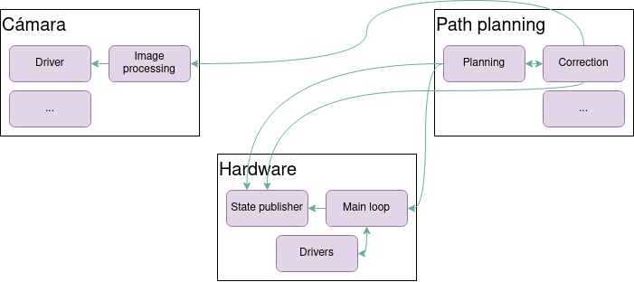
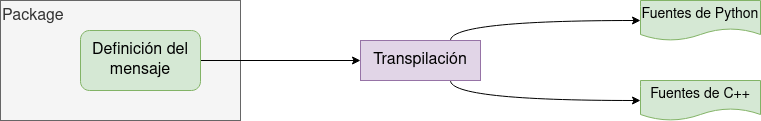

<!-- _class: titlepage -->


<div class="title"><i>Robot Operating System</i> (ROS)</div>
<div class="subtitle">Robótica</div>
<div class="author">Alberto Díaz y Raúl Lara</div>
<div class="date">Curso 2022/2023</div>
<div class="organization">Departamento de Sistemas Informáticos</div>

[](https://creativecommons.org/licenses/by-nc-sa/4.0/)

---
  
# Contenidos

<!-- _class: cool-list -->

1. *Introducción*
2. *Instalación de ROS*
3. *Nodos*
4. *Topics y mensajes*
5. *Servicios*
6. *Launchers*
7. *Parámetros*

---

# ¿Qué es <i>Robot Operating System</i> (ROS)?

Pues, aunque se denomine <i>Robot Operating System</i>:

- Ni es un sistema operativo, ni es exclusivo para robots

Es un **framework** y un **middleware** para desarrollar aplicaciones distribuidas

- **Framework**: Establece las prácticas y conceptos con los que trabajar
- **Middleware**: Sirve de intermediario de comunicación entre componentes
- Es <i>Open Software</i>, licenciado bajo la [BSD 3-Clause](https://choosealicense.com/licenses/bsd-3-clause/)

Incluye sistema de gestión de paquetes para desarrollar y despliegar Software

- En C++ y Python

---

# ¿Para qué? Podemos programarlos desde cero

Sólo hay que desarrollar **drivers** para cada uno de los sensores y actuadores

Desarrollar también la infraestructura de **comunicaciones**

- Que soporte además, los diferentes **protocolos** de diferentes hardwares

También escribir los algoritmos asociados a la **percepción**

Si es móvil, también los algoritmos de **navegación** y **path planning**

Ojo, no olvidemos tampoco el mecanismo para sacar los <i>**logs**</i>

Ah, y la **gestión de errores**

---

# Ya entiendo, <i>no reinventar la rueda</i>

Exacto; tradicionalmente el desarrollo de un robot era una tarea muy tediosa

- En esencia se construían desde cero prácticamente todos sus componentes

Con ROS se intenta minimizar ese efecto de reinventar la rueda; para ello:

- Se incluyen múltiples librerías de componentes de uso típico

Ofrece además una infraestructura de comunicación <i>language agnostic</i>

- ¡Permitiendo diferentes lenguajes dentro de una misma aplicación!

---

# Versiones

En la actualidad coexisten dos versiones independientes en desarrollo

1. **ROS1**: La versión original, bastante extendida aunque ya en desuso
1. **ROS2**: Con nuevas funcionalidades, mejoras y soporte desde 0 para Python3

ROS2 trata de **superar las limitaciones** impuestas por su predecesor, ROS1

**Debemos procurar usar ROS2 en la medida de lo posible**

- Y si no es posible, valorar **mucho** migrar de ROS a ROS2
---

# ¿Y qué vamos a ver?

Veremos tanto el funcionamiento básico como las funcionalidades del core

- Lo consideramos suficiente para desarrollar nuestras primeras aplicaciones
- Veremos algunas librerías externas (pero no todas, que sería una locura)

Cada nueva aplicación afianzará estos conocimientos

- Y obtendréis nuevos, que os harán más eficientes en sucesivos desarrollos

Si consideráis que falta, sobra, o que se podría mejorar algo...

- <i>... igual estaría bien proponer algún que otro pull-request...</i>

---

# Instalación de ROS2<!--_class: transition-->

---

# ¿Qué distribución elegir?

La lista se encuentra en [https://index.ros.org/doc/ros2/Releases/](https://index.ros.org/doc/ros2/Releases/)

- Órden alfabético $\equiv$ órden cronológico (<i>Dashing</i>, <i>Eloquent</i>, <i>Foxy</i>, etcétera)
- Para elegir (si el proyecto no depende de una versión en concreto):
  - Comprobar la <i>End of Life</i> (EOL)
  - Comprobar si es <i>Long Term Support</i>
  - Comprobar el sistema operativo sobre el que funciona
  - **Recomendación**: Usar la última LTS sobre GNU/Linux

Nosotros instalaremos **Humble Hawksbill** sobre **Ubuntu GNU/Linux 22.04**

- Proceso de instalación: <https://docs.ros.org/en/humble/Installation.html>

---

# Hola mundo

De esta manera comprobamos que todo funciona

1. Abrimos dos terminales independientes
1. En la primera escribimos lo siguiente:

   ```bash
   $ ros2 run demo_nodes_cpp talker
   ```

1. En la segunda escribimos lo siguiente:

   ```bash
   $ ros2 run demo_nodes_cpp listener
   ```

Si en ambos se ven los mismos mensajes, nuestra instalación es correcta

---

# Breve nota sobre la <i>Command Line Interface</i> (CLI)

La CLI permite ejecutar instrucciones de un programa o sistema operativo

- Tras la instalación de ROS tenemos acceso al comando `ros2`
- `ros2` y pulsar dos veces `<TAB>` no dará la lista de todas las instrucciones

`ros2 run` espera que le indiquemos un paquete y uno de sus nodos

- Esto quiere decir que podemos lanzar cualquier ejecutable de ros

También podemos ejecutar `ros2 run` y pulsar dos veces `<TAB>`

- Así veremos todos los paquetes accesibles desde nuestra posición.

Con `-h` accederemos a la ayuda de cualquier comando de `ros2`

---

# Nodos<!--_class: transition--> 

---

# Sobre nodos, paquetes y <i>workspaces</i>

Las aplicaciones en ROS se componen de nodos principalmente

- Se puede pensar en ellos como **procesos independientes**
- Se agrupan en **paquetes**

¿Paquetes?

- **Componentes** de nuestro programa; incluyen los fuentes de este
- Se encuentran en el directorio de instalación de ROS o en nuestro <i>workspace</i>

¿<i>Workspace</i>?

- Espacio de trabajo (**directorio**) con las aplicaciones a ejecutar

---

# Creación de un espacio de trabajo

El espacio de trabajo es donde se escribe el código de nuestra aplicación y donde se compila

El desarrollo suele ser un proceso tedioso, porque implica muchas tareas:

- Crear y gestionar paquetes
- Gestionar las dependencias de componentes
- Compilar paquetes
- Desplegar

¡Ójala existiese una herramienta para gestionar los espacios de trabajo!

---

# `colcon`

Herramienta para la gestión de los espacios de trabajo

- Está creada específicamente para ROS2
- Pero no viene instalada por defecto

Instalación (como superusuario)

```bash
$ apt install python3-colcon-common-extensions
```

Para habilitar el autocompletado (recomendable añadir al `~/.bashrc`)

```bash
$ source /usr/share/colcon_argcomplete/hook/colcon-argcomplete.bash
```

---

# Ahora sí, creación de un espacio de trabajo

1. Creamos un directorio para nuestro <i>workspace</i> (e.g. bajo `$HOME/ros_ws`):
1. Accedemos al <i>workspace</i> y creamos un nuevo directorio llamado `src`:
   - Aquí se almacenará todo el código fuente de nuestros componentes
1. A la misma altura que el directorio `src` (no dentro) creamos nuestro <i>workspace</i>, usando la herramienta `colcon`

   ```bash
   $ colcon build
   ```

   - Creará directorios `install/` y `logs/` si no existen
   - También los ficheros de configuración de <i>workspace</i> si no existen
   - Construirá todos los componentes (paquetes) de nuestra aplicación
1. Cargamos `setup.bash` del directorio `install/`, creado tras `build`:
   - Suele ser útil añadirlo al `~/.bashrc`

---

# Creación de un paquete

Los pasos a realizar son los siguientes

1. Vamos al directorio `src/` de nuestro <i>workspace</i>
1. Ejecutamos el comando para la creación de paquetes

   ```bash
   $ ros2 pkg create super_pkg --build-type ament_python --dependencies rclpy
   ```

   - Esto creará un paquete llamado `super_pkg`...
   - ... usando el sistema <i>ament</i> para la creación de paquetes ...
   - ... de tipo `python`
   - ... dependiente de la librería `rclpy`

`rclpy` es la librería base de ROS y la usaremos prácticamente siempre

---

# Contenido de un paquete

La estructura de un paquete de tipo Python es la siguiente:

- Directorio `resource/` para incluir recursos necesarios que no son fuentes
  - Por ejemplo, archivos de configuración interna
- Directorio `test/`, con los fuentes para probar el paquete
- Fichero `package.xml`, que describe información del paquete como puede ser:
  - Metainformación relativa a nombre, versión, ...
  - Dependencias comunes y exclusivas para pruebas
  - Sistema de construcción (<i>build system</i>)
- Fichers `setup.py` y `setup.cfg` para la instalación del paquete

Con esto se puede compilar el paquete a través de `colcon build`

---

# ¿Y qué es un nodo?

Son el componente principal de nuestras aplicaciones

- Un único nodo debería tener (idealmente) un único propósito
- Se comunican entre sí a través de la infraestructura de mensajería de ROS

<center>


<center>

---

# Creación de un nodo

Los fuentes de los nodos se almacenan dentro del paquete

- En un directorio que se llama igual que este
- Ahí crearemos el fichero de código de nuestro nodo

Crearemos la estructura para la ejecución de este fuente (e.g. `node.py`):

```python
#!/usr/bin/env python3

def main(args=None):
   pass

if __name__ == '__main__':
   main()
```

- El <i>shebang</i> (`#!`) es obligatorio, ya que el fichero `.py` será el ejecutable

---

Lo primero que tenemos que hacer en nuestro programa será inicializar el sistema de comunicación de ROS

- Y pasarle los argumentos, en caso de que los haya

```python
#!/usr/bin/env python3

import rclpy

def main(args=None):
   rclpy.init(args=args)
   # Nuestro código
   rclpy.shutdown()

if __name__ == '__main__':
   main()
```

- Si nos acordamos, `rclpy` es la dependencia con la que creamos el paquete

---

`rclpy.init` es la primera instrucción en prácticamente cualquier aplicación

- Entre otros, arranca el sistema de comunicación de ROS
- La aplicación fallará si intentamos usar cualquier característica antes

`rclpy.shutdown` debe ser la última línea de nuestra aplicación

- Cerrará la infraestructura de comunicación

Hasta ahora no hemos creado ningún nodo

- Esto es únicamente la preparación del entorno en el que se ejecutará

---

Ahora crearemos un nodo en la función `main` de nuestro `script`

```python
...
from rclpy.node import Node
...
   rclpy.init(args=args)
   node = Node('Sensor')
   rclpy.shutdown()
...
```

`Sensor` será el nombre de nuestro nodo

- Por convención no se usa la palabra <i>node</i> porque sería redundante

Ahora podemos ejecutar nuestro nodo de la siguiente manera:

```bash
$ chmod u+x node.py
$ ./node.py
```

---

En este punto hemos creado un nodo; concretamente

1. Nos conectamos a la infraestructura de ROS, creándola si no existía
2. Creamos un nodo y lo arrancamos
3. Nos desconectamos de la infraestructura y cerramos la aplicación

De acuerdo, de utilidad nos ha quedado un poco regular, pero quedémonos con tres conceptos:

1. **El nodo NO es el fichero** de Python, sino que se crea dentro de este
1. **El nombre del nodo NO es el nombre del fichero**, sino que es el nombre del objeto cuando lo creamos

Ahora, hagamos algo más visible

---

Sacaremos por pantalla un mensaje de <i>log</i>

- Para ello usaremos el logger asociado al nodo

```python
...
   node = Node('Sensor')
   node.get_logger().info('Hello, world!')
   rclpy.spin(node)
...
```

`rclpy.spin` es un método extremadamente importante

- Se usará en prácticamente todos los fuentes desarrollados en ROS
- Su cometido es pausar el programa y dejar el nodo en modo escucha
- Los <i>callbacks</i> asociados a los mensajes se llamarán desde este método

Si queremos parar el proceso basta con ejecutar `CTRL+C`

---

# Estructura básica de un nodo en Python

```python
#!/usr/bin/env python3

import rclpy
from rclpy.node import Node

def main(args=None):
    try:
        rclpy.init(args=args)
        node = Node('py_test')
        node.get_logger().info('Hello, 🤖!')
        rclpy.spin(node)
    finally:
        rclpy.shutdown()

if __name__ == '__main__':
    main()
```

---

# Instalación del nodo

La ejecución que hemos hecho el nodo ha sido un poco trampa

- En realidad hemos ejecutado el fichero fuente, no el nodo desplegado

Podríamos trabajar así, pero es poco escalable

- Al no estar instalados en el workspace, no están dentro del `PATH`
- Por ello, queremos instalar y desplegar los nodos

Al estar usando Python, nos evitaremos un paso (transparente para nosotros)

- En C++ los fuentes hay que compilarlos, en Python no
- Únicamente se copiarán los fuentes de un lado a otro

---

Instalaremos nuestro paquete usando dos ficheros de configuración:

- Fichero `setup.cfg`: Información de dónde se instalarán nuestros fuentes

   ```python
   [develop]
   script-dir=$base/lib/NOMBRE_DEL_PAQUETE
   [install]
   install-scripts=$base/lib/NOMBRE_DEL_PAQUETE
   ```

- Fichero `setup.py`: Metainformación de nuestros fuentes

   ```python
   from setuptools import setup
   #...
   setup(
      # ...
      entry_points={'console_scripts': ["exec_name = PAQUETE.NODO:main"],},
   )
   ```
   <!-- En entry_points->'console_scripts' hay que indicar cuáles son los nodos que instalamos, con una línea donde se especifica el ejecutable. Lo que hará es coger ese fichero .py, copiarlo, realizar una serie de modificaciones, entre las que se incluye hacerlo ejecutable (como hemos hecho nosotros) e instalarlo en el directorio install de nuestro workspace -->

El comando `colcon build` realizará la instalación de los fuentes

<!-- Necesitamos especificar un nombre para nuestro ejecutable: "py_node = my_py_pkg.my_first_node:main" -->

---

Tras la ejecución de `colcon build`, nuestros nodos:

- Se habrán compilado (sólo en el caso de C++)
- Se habrán desplegado en el directorio indicado en `setup.cfg`
- Se habrán marcado como ejecutables

Ya podemos ejecutar nuestro nodo como cualquier otro nodo de ROS:

```bash
ros2 run nombrepaquete nombrenodo
```

- Esto es así porque hemos añadido nuestro <i>workspace</i> al `PATH` de ROS

---

# (BONUS TRACK) Plantilla de un nodo como clase

```python
#!/usr/bin/env python3
import rclpy
from rclpy.node import Node

class MyNode(Node):
    def __init__(self):
        super().__init__('py_test')
        self.i = 0
        self.create_timer(0.5, self.timer_callback)

    def timer_callback(self):
        self.i += 1
        self.get_logger().info('🤖 #{self.i}')

def main(args=None):
    try:
        rclpy.init(args=args)
        node = MyNode()
        rclpy.spin(node)
    finally:
        rclpy.shutdown()

if __name__ == '__main__':
    main()
```

---

# Recapitulando

Hemos visto qué son espacios de trabajo, paquetes y nodos

- Sabemos crear el espacio de trabajo de nuestro robot (`colcon`)
- Sabemos construir paquetes que contendrán el software de nuestra aplicación

Los nodos son subprogramas existentes dentro de nuestra aplicación

- Cada uno es **responsable de una y solo una funcionalidad**

Los nombres del fuente, el instalado y el nodo no tienen por qué coincidir

- Sabemos instalar los paquetes, y lanzarlos con

   ```bash
   ros2 run <paquete> <executable>
   ```

---

<!--
   _class: transition
-->

# <i>Topics</i> y mensajes

---

# Topic

Es un bus de datos para el intercambio de datos entre nodos

- Está caracterizado por un **nombre único** y un **tipo de mensaje**
- Provee de un mecanismo de **comunicación unidireccional**
- Los datos que se intercambian se denominan **mensajes**

La **comunicación** es, en principio, **anónima**

- Quien envía el mensaje no sabe quién lo quiere recibir y viceversa
  - **<i>Publisher</i>**: Publica un mensaje en el bus
  - **<i>Subscriber</i>**: Recibe un mensaje del bus

<i>Publisher</i> y <i>subscriber</i> de un **mismo topic** deben compartir el **mismo tipo de mensaje**

---

# Enviando mensajes

El envío de mensajes es tipo <i>broadcast</i>: sé qué envío, pero no quién escucha

Para crear un bus usaremos el método `create_publisher` de `Node`:

```python
publisher = <nodo>.create_publisher(<mensaje>, <publisher>, <buffer>)
```

- No hemos visto tipos de mensajes, así que usaremos uno ya existente:

   ```bash
   ros2 interface show example_interfaces/msg/String
   ```

  - `ros2 interface` ayuda a encontrar los interfaces (tipos de mensajes)
  - Usaremos el mensaje `String` del paquete `example_interfaces`
  - Más adelante aprenderemos cómo crear nuestros propios mensajes
- Ojo: si el <i>buffer</i> se llena, los mensajes se dejan de enviar y se descartan

---

Los mensajes se importan en nuestro código como cualquier módulo:

```python
from example_interfaces.msg import String
```

- Al ser de un paquete, tenemos que especificar la dependencia (`package.xml`)

   ```xml
   <depend>example_interfaces</depend>
   ```

Tras la importación ya se puede usar en nuestro código, creando el publisher:

```python
self.publisher = self.create_publisher(String, 'emisora', 10)
```

Y enviando mensajes

```python
msg = String()
msg.data = 'Hola 🤖!'
self.publisher.publish(msg)
```

---

# Ejemplo de <i>publisher</i>

```python
#!/usr/bin/env python3

...
from example_interfaces.msg import String


class RadioStationNode(Node):

    def __init__(self):
        super().__init__("station")

        self.publisher = self.create_publisher(String, "radio_station", 10)
        self.timer = self.create_timer(0.5, self.publish_news)
        self.get_logger().info("Radio station launch!")

    def publish_news(self):
        msg = String()
        msg.data = ‘Hi there! There are no new news’
        self.publisher.publish(msg)

...
```

---

# Breve nota sobre la CLI

Si ejecutamos este nodo, podemos ver los topics que hay ejecutando:

```bash
ros2 topic list
```

- Nos permite ver **TODOS** los topics que están funcionando en este mismo momento

Si queremos ver el contenido que se está publicando en un topic concreto:

```bash
ros2 topic echo /emisora
```

---

# Recibiendo mensajes

Para recibir mensajes publicados en un <i>topic</i> decimos que nos **suscribimos**

Un <i>subscriber</i> se crea de forma muy parecida a un <i>publisher</i>:

```python
subscriber = <nodo>.create_subscription(<mensaje>, <publisher>, <callback>, <buffer>)
```

- `callback` será el nombre de la función que se ejecutará al recibir un mensaje

---

# Ejemplo de <i>subscriber</i>

```python
#!/usr/bin/env python3

...
from example_interfaces.msg import String


class SmartphoneNode(Node):
    def __init__(self):
        super().__init__("smartphone")
        self.subscriber = self.create_subscription(
            String, "radio_station", self.callback, 10
        )
        self.get_logger().info("Smartphone is listening!")

    def callback(self, msg):
        self.get_logger().info(msg.data)
...
```

---

# Topics y la línea de comandos (I)

Algunos comandos muy útiles relacionados con topis de la CLI son:

- Listado de todos los topics que se están usando

  ```bash
  ros2 topic list
  ```

- Información concreta del topic

  ```bash
  ros2 topic info <topic>
  ```

- Saca por pantalla la información que se está publicando en el topic

  ```bash
  ros2 topic echo <topic>
  ```

- Estima la frecuencia a la que se publica la información en el topic

  ```bash
  ros2 topic hz <topic>
  ```

---

# Topics y la línea de comandos (y II)

- Calcula el ancho de banda usado por los mensajes del topic

  ```bash
  ros2 topic bw <topic>
  ```

- Publica el mensaje en el topic

  ```bash
  ros2 topic pub <topic> <tipo> {json_data}
  ```

- Renombra el topic

  ```bash
  $ ros2 run power_pkg news_station \
           --ros-args -r <old_topic>:=<new_topic>
  ```

---

# Sobre los mensajes en ROS

En la página sobre interfaces se describen todos los tipos de datos básicos

- <https://docs.ros.org/en/humble/Concepts/About-ROS-Interfaces.html>

Los tipos de datos complejos suelen tener sus propios repositorios

- E.g. <http://github.com/ros2/example_interfaces>
- Se encuentran bajo `msg/` (y `srv/`, pero eso lo veremos más adelante)
- Los ficheros `.msg` dan la misma información que ejecutar `ros2 interfaces`

Un repositorio muy útil para aplicaciones reales es `common_interfaces`

- <http://github.com/ros2/common_interfaces>
- Se instalan por defecto al realizar la instalación de `ros desktop`

---

# Mensajes personalizados

Un topic se caracteriza por un **nombre** y una **interfaz** o tipo

- El tipo de mensaje se describe con una sintaxis propia de ROS
- Durante la compilación del <i>workspace</i> (`colcon`) cada mensaje se <i>transpila</i>
- Con este proceso se generarán los fuentes específicos para cada lenguaje

<center>


</center>

Un convenio que se sigue a rajatabla es:

- Si el tipo es básico, empieza en minúscula (e.g. `int`, `string`)
- Si el tipo es compuesto, en mayúscula (e.g. `Header`)

---

# Estructura de una interfaz (`PointCloud2.msg`)

```bash
# This message holds a collection of N-dimensional points, which may
# ...
# such as stereo or time-of-flight.

# Time of sensor data acquisition, and the coordinate frame ID (for 3d points).
std_msgs/Header header

# 2D structure of the point cloud. If the cloud is unordered, height is
# 1 and width is the length of the point cloud.
uint32 height
uint32 width

# Describes the channels and their layout in the binary data blob.
PointField[] fields

bool    is_bigendian # Is this data bigendian?
uint32  point_step   # Length of a point in bytes
uint32  row_step     # Length of a row in bytes
uint8[] data         # Actual point data, size is (row_step*height)

bool is_dense        # True if there are no invalid points
```

---

# Tipos de mensajes (interfaces) personalizados

Las interfaces se suelen crear en paquetes dedicados a exclusivamente a ello

- Por reducir dependencias; se pueden crear en cualquier paquete

   ```bash
   ros2 pkg create sensor_interfaces
   ```

- Lo del sufijo `_interfaces` es otro convenio que se suele usar en ROS
- El directorio `src/` no se suele usar, así que lo más común es borrarlo

Cada tipo de mensaje va en un fichero `.msg` dentro del directorio `msg/`

- Si el directorio no existe, es necesario crearlo
- El convenio para nombrar ficheros de mensaje es `CamelCase`

---

# Pasos para la creación de una interfaz

Dentro del paquete donde queramos definir la interfaz:

1. Creamos la interfaz (fichero `.msg`) dentro del directorio `msg/`
1. Añadimos (si no existen) las dependencias del transpilador a `package.xml:`

   ```xml
   <build_depend>rosidl_default_generators</build_depend>
   <exec_depend>rosidl_default_runtime</exec_depend>
   <member_of_group>rosidl_interface_packages</member_of_group>
   ```

1. Las añadimos también (si no existen ya) al fichero `CMakeList.txt`:

   ```cmake
   find_package(rosidl_default_generators REQUIRED)
   ```

1. Añadimos el mensaje al transpilador

   ```cmake
   rosidl_generate_interfaces(${PROJECT_NAME} "msg/<INTERFAZ>.msg")
   ```

---

# Usando una interfaz

Al igual que hemos hecho con las interfaces preinstaladas, basta con:

1. Añadir la dependencia del paquete que contiene la interfaz a `package.xml`

   ```xml
   <depend>paquete_con_interfaces</depend>
   ```

1. Importar la interfaz del paquete en nuestros fuentes

   ```python
   from paquete_con_interfaces.msg import Interfaz
   ```

---

<!--
   _class: transition
-->

# Servicios

---

# Servicio

Es un sistema de comunicación de arquitectura **cliente/servidor**

- Permiten la comunicación **síncrona o asíncrona** entre nodos
- Están pensados para la comunicación bidireccional entre nodos
  - Dos tipos de mensaje, uno para la <i>request</i> y otro para la <i>response</i>
  - Eso sí, ambos tipos se encuentran dentro del mismo fichero `.msg`
- Un único servidor sólo puede existir una vez en una aplicación
  - Eso sí, puede ser accedido por múltiples clientes

---

# Creación de un servidor

Un servicio se caracteriza por un **nombre único** y una **interfaz**

- Vamos, como un <i>topic</i>
- Eso sí, las interfaces incluyen dos tipos de mensaje: **request** y **response**
- Se separan por tres guiones (encima <i>request</i>, debajo <i>response</i>)

Por ejemplo, un servicio para localizar el número de vehículos en un área:

```text
float32 lat
float32 lon
float32 radius
---
int64 n
```

---

Para crear el servidor usaremos el método `create_service` de `Node`:

```python
server = <nodo>.create_service(<mensaje>, <name>, <callback>)
```

- Convenio para nombrar los servicios: Comenzar su nombre por un verbo
- Por ejemplo, `'get_number_of_vehicles'`

El <i>callback</i> será una función que recibirá dos parámetros

- Objeto <i>request</i> con el contenido de la petición hecha al servidor
- Objeto <i>response</i> a rellenar para devolver al cliente de la petición

   ```python
   def callback_get_number_of_vehicles(self, request, response):
      response.sum = request.a + request.b
      self.get_logger().info(f'{request.a} + {request.b} = {response.sum}')
      return response
   ```

Podemos ver que el funcionamiento es similar al de los <i>topics</i>

---

Por último, nos quedaría la configuración:

1. Añadir el nodo al setup.py

   ```python
   get_number_of_vehicles_server = paquete.get_number_of_vehicles_server:main
   ```

2. Construir y desplegar el paquete

   ```bash
   colcon build --packages-select my_py_pkg --symlink-install
   ```

En este punto ya podemos lanzar nuestro nodo

```bash
ros2 run my_py_pkg get_number_of_vehicles
```

Para comprobar el funcionamiento necesitaremos un cliente que acceda al servicio

---

# Breve nota sobre la CLI (sí, otra más)

Siempre es posible testear el server directamente desde la terminal

- Para conocer los servicios disponibles usamos el siguiente comando

   ```bash
   ros2 service list
   ```

- También podemos saber la información de un servicio en concreto

   ```bash
   ros2 service info get_number_of_vehicles_server
   ```

- Por último, si lo que queremos es hacer una llamada a un servicio:

   ```bash
   $ service call /get_number_of_vehicles paquete/srv/NoOfVehicles "{ \
      lat: 40.3831651, \
      lon: -3.6222915, \
      radius: 250 \
   }"
   ```

---

# Ejemplo de servidor

```python
#!/usr/bin/env python3
import rclpy
from rclpy.node import Node

from example_interfaces.srv import AddTwoInts

class AddTwoIntsServerNode(Node):
    def __init__(self):
        super().__init__('add_two_ints_server')
        self.server = self.create_service(AddTwoInts, ‘add_two_ints’, self.callback_add_two_ints)
        self.get_logger().info('Add two ints server has been started.')

    def callback_add_two_ints(self, request, response):
        response.sum = request.a + request.b
        self.get_logger().info(f'{request.a} + {request.b} = {response.sum}'))

        return response
```

---

# Creación de un cliente

Para realizar llamadas a un servicio necesitamos crear un cliente

```python
client = <node>.create_client(<interface>, <nombre>)
```

Las llamadas se realizan usando el método `call` del cliente

```python
response = client.call(request)
```

Al igual que con el servidor o con un topic, es necesario:

1. Actualizar el `setup.py`

   ```python
   get_number_of_vehicles_client = paquete.get_number_of_vehicles_client:main
   ```

2. Construir y desplegar el paquete

---

Cuidado, los nodos son independientes entre sí:

- Puede pasar que se llame a un servicio sin que este esté se haya arrancado
- Para que el método no dé error, lo típico es realizar una espera

   ```python
   while not client.wait_for_service(<timeout>):
      node.get_logger().warn('Esperando al servicio ...')
   ```

- El timeout es opcional; si no se especifica esperará indefinidamente

---

# Llamadas síncronas y asíncronas

`call` realiza una **llamada bloqueante**, y lo más común es usar `call_async`

   ```python
   future = client.call_async(request)
   ```

- <i>Future</i>: objeto que en algún momento tendrá la respuesta a la llamada
- Podemos dejar el proceso esperando la respuesta de la siguiente manera:

   ```python
   rclpy.spin_until_future_complete(node, future)
   ```

- Una vez la instrucción finaliza, en el objeto future tenemos la respuesta

   ```python
   try:
      response = future.result()
      self.get_logger().info(a + b = sum)
   except Exception as e:
      node.get_logger().error(f'Error: {e}')
   ```

---

# Ejemplo de cliente

```python
#!/usr/bin/env python3

import rclpy
from rclpy.node import Node
from functools import partial

from example_interfaces.srv import AddTwoInts

class AddTwoIntsClientNode(Node):
    def __init__(self):
        super().__init__('add_two_ints_client')
        self.call_add_two_ints_server(1, 2)

    def call_add_two_ints_server(self, a, b):
        client = self.create_client(AddTwoInts, 'add_two_ints')
        while not client.wait_for_service(1.0):
            self.get_logger().warn('Waiting for server')
        request = AddTwoInts.Request()
        request.a = a
        request.b = b

        future = client.call_async(request)
        future.add_done_callback(partial(
            self.callback_call_add_two_ints,
            a=a, b=b
        ))

    def callback_call_add_two_ints(self, future, a, b):
        try:
            response = future.result()
            self.get_logger().info(f'{a} + {b} = {response.sum}')
        except Exception as e:
            self.get_logger().error('{e}')
```

---

<!--
   _class: transition
-->

# <i>Launchers</i>

---

# <i>Launcher</i>

Define la ejecución de uno o varios nodos de un componente o aplicación

- Una **aplicación de ROS** puede llegar a tener **cientos de nodos**
- ¿Os imagináis arrancar uno por uno desde la terminal?
- ¿Y entrar en remoto al robot para decidir qué nodos arrancar y cómo?

¿Por qué no hacerlo con un script de bash?

- ¿`sh`? ¿`bash`? ¿`csh`? ¿`zsh`? ... Más cómodo un <i>launcher</i>, que es estándar

El sistema de <i>launchers</i> **describe** y **ejecuta** la configuración del **sistema**:

- Qué programas ejecutar, dónde, qué argumentos, renombrados, de <i>topics</i>, ...
- También monitoriza y el estado de los nodos y reacciona a sus cambios

---

# Creación de un <i>launcher</i>

Los ficheros se escriben en Python, XML o YAML; dicho esto, ¿cuál usar?:

- XML es el usado en ROS1, por lo que suele ser el más familiar.
- YAML ofrece una sintaxis más comoda respecto a XML.
- Python es un lenguaje de programación: más verboso, pero también más potente.

En definitiva, la elección se reduce a las preferencias del desarrollador.

- Eso sí, si necesitamos comportamiento en lugar de sólo definición, Python

---

Suele ser común crear un paquete exclusivo para los <i>launchers</i>:

- Al ser exclusivo, podemos prescindir de los directorios `include/` y `src/`
- Crearemos el directorio `launch/`, que es el convenio para los <i>launchers</i>
- Añadiremos `ros2launch` como dependencia de ejecución a `package.xml`:
  ```xml
  <exec_depend>ros2launch</exec_depend>
  ```

Tras esto ya podemos desarrollar nuestros launcher en el directorio `launch/`

- La convención de nombrado es `<nombre>_launch.[py|xml|yaml]`

---

# Ejemplo de <i>launcher</i> en Python

```python
from launch import LaunchDescription
from launch_ros.actions import Node

def generate_launch_description():
    return LaunchDescription([
        Node(
            package='one_package',
            namespace='namespace_a',
            executable='node',
            name='one',
        ),
        Node(
            package='other_package',
            namespace='namespace_b',
            executable='node',
            name='other',
        ),
    ])
```

---

# Ejemplo de <i>launcher</i> en XML

```python
<launch>
  <node pkg="one_package"
        namespace="namespace_a"
        exec="node"
        name="one"/>
  
  <node pkg="other_package"
        namespace="namespace_b"
        exec="node"
        name="other"/>
</launch>
```

---

# Ejemplo de <i>launcher</i> en YAML

```python
launch:

- node:
    pkg: "one_package"
    namespace: "namespace_a"
    exec: "node"
    name: "one"

- node:
    pkg: "other_package"
    namespace: "namespace_b"
    exec: "node"
    name: "other"
```

---

# Una vez escritos los <i>launchers</i>

Basta con construir el paquete y lanzar el launcher con el comando `launch`:

```bash
$ ros2 launch <PAQUETE> <NUESTRO_LAUNCHER>
```

**Ojo**, debemos añadir las dependencias en nuestro paquete

```xml
<exec_depend>one_package</exec_depend>
<exec_depend>other_package</exec_depend>
```

- No las necesitamos para construir el paquete, sólo para ejecutar

---

# Argumentos de un <i>launcher</i>

Podemos especificar desde el <i>launcher</i> los argumentos igual que en la CLI

- Cambiar nombre de nodo

   ```python
   Node(package='paquete', executable='nodo_o_launcher',name='nuevo_nombre')
   ```

- Cambiar el nombre de un topic o de un servicio

   ```python
   Node(
      package='paquete', executable='nodo_o_launcher',name='nuevo_nombre',
      remappings=[
         ('topic', 'topic_renombrado'),
         ('servicio', 'servicio_renombrado'),
      ]
   )
   ```

---

# Parámetros<!-- _class: transition -->

---

# ¿Qué es un parámetro?

Un parámetro es un valor de configuración de un nodo

- Son utilizados tanto en el arranque como durante el tiempo de ejecución
- Su tiempo de vida es el del nodo al que pertenece
- Caracterizado por el <i>namespace</i> del nodo, <i>namespace</i> del parámetro (opcional) y nombre

Cada parámetro está compuesto de una clave, un valor y un descriptor

- Clave es una cadena de texto
- Valor: `bool`, `int64`, `float64`, `string`, `byte[]`, `bool[]`, `int64[]`, `float64[]`, `string[]`
- Descriptor: cadena de texto con información adicional (por defecto está vacío)

---

# Declaración de parámetros

Los parámetros se declaran **en el momento de iniciar el nodo**

- Reduce las posibilidades de una mala configuración posterior
- Se establecen mediante el método `declare_parameter` de la clase `Node`

   ```python
   <node>.declare_parameter('<nombre>', <valor>)
   ```

- El tipo de parámetro se infiere del valor por defecto

Es posible usar un nodo con parámetros no declarados

- Hay que crear el nodo con el argumento `allow_undeclared_parameter=true`
- Útil si no todos los parámetros son conocidos de antemano

---

# Trabajando con parámetros desde un mismo nodo

Una de las gracias de los parámetros es poder usarlos durante la ejecución del nodo

- Establecer el valor de un parámetro: método `set_parameters` de `Node`

   ```python
   param = rclpy.parameter.Parameter('<nombre>', <tipo>, <valor>)
   <nodo>.set_parameters([param])
   ```

  - Los tipos están disponibles bajo el enumerado `rclpy.Parameter.Type`
- Acceder al valor de un parámetro: método  `get_parameter` de `Node`

   ```python
   param = <nodo>.get_parameter('<nombre>')
   valor = param.get_parameter_value().<tipo>_value
   ```

---

# Gestionando los parámetros desde la CLI

Podemos listar todos los parámetros de la aplicación actual con `list`

```bash
ros2 param list
```

- Se mostrarán todos los parámetros disponibles clasificados por nodo
- Todo nodo tiene el parámetro `use_sim_time` para sincronizar simulaciones

Para obtener el tipo y el valor de un parámetro usaremos `get`

```bash
ros2 param get <nodo> <parámetro>
```

---

También podemos establecer valores, esta vez con el comando `set`

```bash
ros2 param set <nodo> <parámetro> <valor>
```

Para saber el estado de todos los parámetros de un nodo, podemos usar `dump`

```bash
ros2 param dump <nodo>
```

- El formato es `.yaml`, y podemos salvarlo en un fichero para su posterior uso

`dump` se complementa con `load` que carga los parámetros desde un fichero

```bash
ros2 param load <nodo> <fichero>
```

Por último, el fichero de parámetros se puede usar como configuración inicial

```bash
ros2 run <paquete> <nodo> --ros-args --params-file <fichero>
```

---

# Gestionando los parámetros desde un <i>launcher</i>

Los valores de un nodo se establecen con el argumento `parameters`

```python
from launch import LaunchDescription
from launch_ros.actions import Node

def generate_launch_description():
    return LaunchDescription([
        Node(
            package='<paquete>',
            executable='<fichero>',
            name='<nodo>',
            parameters=[
                {'<un_parametro>': <un_valor>}
                {'<otro_parametro>': <otro_valor>}
            ]
        )
    ])
```

---

# ¡GRACIAS!<!--_class: transition-->
