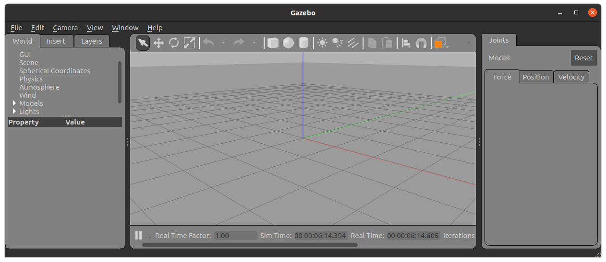
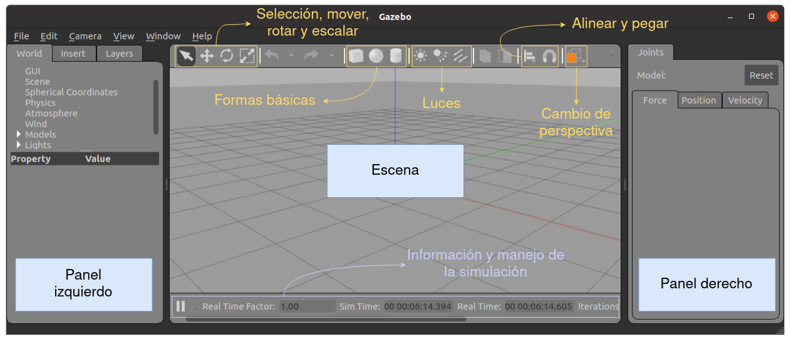

<style>

   .cite-author {
      text-align        : right;
   }
   .cite-author:after {
      color             : orangered;
      font-size         : 125%;
      font-weight       : bold;
      font-family       : Cambria, Cochin, Georgia, Times, 'Times New Roman', serif;
      padding-right     : 130px;
   }
   .cite-author[data-text]:after {
      content           : " - "attr(data-text) " - ";
   }

   .cite-author p {
      padding-bottom : 40px
   }

</style>

<!-- _class: titlepage -->


<div class="title">El simulador Gazebo</div>
<div class="subtitle">Robótica</div>
<div class="author">Alberto Díaz y Raúl Lara</div>
<div class="date">Curso 2022/2023</div>
<div class="organization">Departamento de Sistemas Informáticos</div>

[](https://creativecommons.org/licenses/by-nc-sa/4.0/)

---
  
# Contenidos

<!-- _class: cool-list -->

1. *Introducción*
1. *Creación de modelos simples*

---

<!--
   _class: transition
-->

# Introducción

---

# ¿Qué es Gazebo?

Gazebo es una aplicación para la simulación 3D de aplicaciones robóticas

- Está provisto de un motor físico altamente detallado
- Ofrece un gran conjunto de sensores e interfaces

Se usa típicamente para el diseño de robots

- No sólo físico, sino también de algoritmos
- Se integra con ROS, por lo que podremos desarrollar y probar aplicaciones robóticas antes de implementarlas en físico

Su instalación es muy sencilla:

```bash
curl -sSL http://get.gazebosim.org | sh
```

---

# Un vistazo a la GUI



---

# Un vistazo a la GUI



---

**Escena**: Donde los objetos (modelos) se diseñan e interactúan con el entorno

**Panel izquierdo**: Gestión de los modelos del entorno

- <i>World</i>: Listado de los modelos que actualmente forman parte de la escena
- <i>Insert</i>: Para añadir nuevos objetos a la simulación
- <i>Layers</i>: Para organizar los objetos de la simulación en grupos de visualización

**Panel derecho**: Interacción con las partes móviles del modelo seleccionado

- Aparece oculto por defecto

**Controles de escenario**: En la parte superior, para mover, rotar, etcétera

**Controles de simulación**: Para consultar y gestionar la simulación

---

<!--
   _class: transition
-->

# Creación de modelos simples

---

# Editor de modelos

Es la herramienta de Gazebo para construir objetos

- Permite construir modelos **simples**
- Permite cargar modelos en formato `.sdf` desarrollados en herramientas externas (e.g. [Blender](https://www.blender.org/)<sup>1</sup>)
- La OSRF dispone de un [repositorio de modelos](https://github.com/osrf/gazebo_models)<sup>2</sup> para su uso en Gazebo

Se accede desde el menú superior, en `Edit->Model Editor` (`CTRL+M`)

- Las físicas (y la simulación) se detendrán mientras estemos en el editor
- El panel izquierdo pasa a tener opciones de crear y editar objetos 3D

> <sup>1</sup> <https://www.blender.org/>
> <sup>2</sup> <https://github.com/osrf/gazebo_models>
---

<!--
   _class: transition
-->

# ¡GRACIAS!
