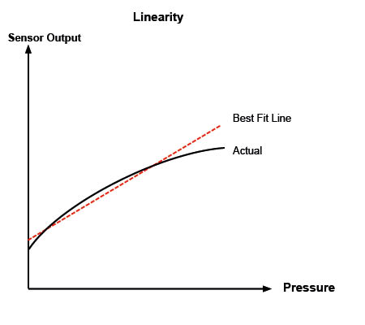
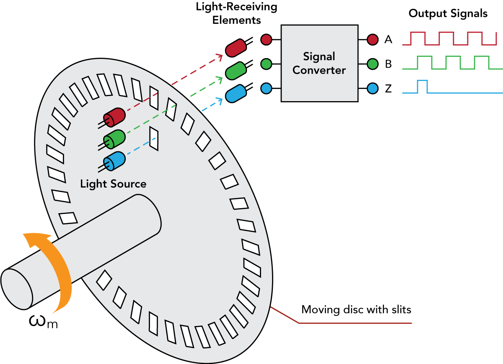
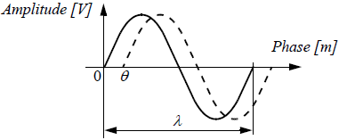
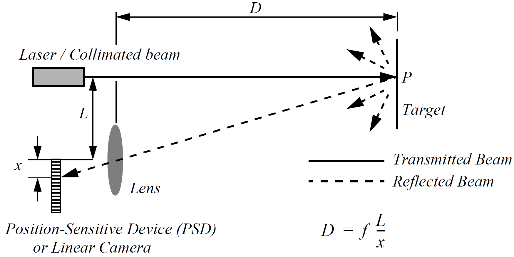

<!-- _class: titlepage -->

Percepción del entorno

Robótica

Alberto Díaz y Raúl Lara

Curso 2022/2023

Departamento de Sistemas Informáticos

---

# Percepción

Para realizar sus tareas, lo primero que necesita un robot es:

1. Tener conocimiento del entorno en el que se encuentra
1. Conocer también su propio estado interno

Un **sensor** toma medidas (o señales) y las procesa para extraer información:

- No es raro; los seres vivos usamos sensores para movernos por el entorno.

  

---

# Clasificación de los sensores

Vamos a clasificar los sensores en función de dos ejes/características:

### Según magnitud medida

**Propioceptivos** o internos

Velocidad del motor, voltaje de la batería, ...

**Exteroceptivos** o externos

Distancia a objeto, intensidad de la luz, amplitud del sonido, ...

### Mecanismo de medición

**Pasivos**

Miden la energía ambiental que entra en el sensor.

**Activos**

Emiten energía al entorno y miden la respuesta del entorno.

---

# Magnitudes físicas medidas

Típicamente, las magnitudes internas y del entorno son las siguientes:

- Distancia 
- Humedad
- Luz
- Magnetismo
- Posición

- Presión y/o fuerza
- Sonido
- Temperatura
- Velocidad

Las medidas **pueden ser indirectas**, para obtener información adicional

---

# Rendimiento de los sensores

**Rango dinámico**: Relación entre los valores máximo y mínimo que puede tomar un determinado valor. Se mide en decibelios ($dB$):

$$
DR_P=10\cdot\log\left [\frac{P_{MAX}}{P_{MIN}} \right], DR_V=20\cdot\log\left [\frac{P_{MAX}}{P_{MIN}} \right]
$$

**Resolución**: Diferencia mínima entre dos valores de medida del sensor.

**Frecuencia** o **ancho de banda**: Velocidad a la cual el sensor es capaz de proporcionar lecturas. Se mide en hertzios ($Hz$).

**Sensibilidad**: Cambio que debe ocurrir en la medida para que el sensor cambie su salida.

---

**Linealidad**: Medida importante que determina el comportamiento de la señal de salida del sensor al variar la señal de entrada:

**Error**: Diferencia entre las mediciones de salida del sensor y los valores reales que se miden.

---

# Sensores de posición

<!-- _class: cool-list -->

1. *Sensores de motores/ruedas*
1. *Sensores de dirección*
1. *Acelerómetros*
1. *Unidad de medida inercial*
1. *Ground beacons*

---

# Sensores de motores/ruedas: <i>Encoders</i>

Son **propioceptivos pasivos** y cuentan con:

1. Disco (o tira) con un patrón
1. Emisor de luz
1. Receptor óptico

Si el disco gira se genera un tren de pulsos cuyo conteo determina la posición.

- Una segunda franja de marcas desplazada permite conocer el sentido de giro
- Una marca única de referencia permite conocer su posición inicial

---

Su resolución depende directamente del número de marcas del disco.

- Cada pulso son dos lecturas: flanco de subida y flanco de bajada

Los más comunes son los de tipo **incrementales**

- El conteo se realiza en cada flanco de subida y bajada
- Una vez se llega al marcador de posición, se reinicia el conteo

Existen también los codificadores **absolutos**

- Cada marca se dispone según un código binario cíclico (normalmente Gray)
- Las resoluciones son potencias de 2
- No necesita mecanismos adicionales para conocer el sentido o la posición

---

<video controls width=100% src="https://drive.upm.es/s/N0cAEdHt2jXRyJF/download"></video>

---

# Sensores de motores/ruedas: <i>Resolvers</i>

Son sensores analógicos formados por dos partes:

1. Estator: Parte fija con bobinas que miden velocidad y posición de giro
1. Rotor: Parte móvil que genera un campo eléctrico que capta el estator

Al ser analógicos, su resolución es teóricamente infinita.

---

<video controls width=100% src="https://drive.upm.es/s/A5kAbxbWpFu0xSE/download"></video>

---

# Sensores de motores/ruedas: Potenciómetros

Los **potenciómetros** son muy similares a los <i>resolvers</i>

- En este caso usan una resistencia con un contacto móvil rotatorio o deslizante
- Los movimientos de un eje cambiarán el voltaje de salida del potenciómetro.

Dan muy bajas prestaciones

- Se suelen emplear en proyectos educativos

---

# Sensores de dirección

Los **giroscopios** son sensores de dirección que conservan su orientación en relación con un marco de referencia fijo.

Proporcionan una medida absoluta de la dirección de un sistema móvil.

Se trata de un sensor *propioceptivo pasivo*.

---

# Sensores de dirección

Una **brújula** nos permite determinar la orientación del robot.

Dos tecnologías:

- **Efecto Hall**: el voltaje de salida es proporcional a la magnitud del campo magnético que lo atraviesa.
- **<i>Flux gate</i>**: dos o más pequeñas bobinas de alambre alrededor de un núcleo de material magnético altamente permeable, para detectar directamente la dirección de la componente horizontal del campo magnético terrestre.

---

# Acelerómetros

Un **acelerómetro** es un dispositivo usado para medir todas las fuerzas externas que actúan sobre él.

Conceptualmente, un **acelerómetro** es una masa unida a un muelle.

Cuando se produce una aceleración, la masa se desplaza hasta el punto en el que el muelle iguala la velocidad de desplazamiento de la carcasa.

Midiendo la extensión del muelle se obtiene la aceleración.

---

# Unidad de medida inercial

Una **<i>inertial measurement unit (IMU)</i>** es un dispositivo que combina giroscopios y acelerómetros para estimar la posición relativa, velocidad y aceleración de un robot móvil.

Un **IMU** estima los seis grados de libertad del vehículo: posición (x, y, z) y orientación (<i>pitch</i>, <i>yaw</i>, <i>roll</i>).

También se le conoce como <i>inertial navigation system (INS)</i>

---

# Ground beacons

Un enfoque elegante para resolver el problema de la localización en la robótica móvil es utilizar **balizas** activas o **balizas** pasivas.

Mediante la interacción de los sensores de a bordo y las **balizas** del entorno el robot puede identificar su posición con precisión.

El sistema de balizas más usado en la actualidad es el **Global Positioning System (GPS)**.

Cuando un receptor GPS lee la transmisión de dos o más satélites, las diferencias de tiempo de llegada informan al receptor sobre su distancia relativa a cada satélite.

Al combinar la información sobre la hora de llegada y la ubicación instantánea de cuatro satélites, el receptor puede inferir su propia posición.

---

# Sensores activos de alcance

Los **sensores de alcance** ofrecen mediciones directas de la distancia entre el robot y los objetos de su entorno.

<!-- _class: cool-list -->

1. *Sensores ultrasónicos*
1. *Sensores láser*
1. *Cámaras <i>time-of-flight</i>*
1. *Sensores de triangulación óptica*
1. *Sensores de luz estructurada*

---

# Sensores ultrasónicos

El principio básico de un **sensor ultrasónico** es transmitir un paquete de ondas de presión (ultrasónicas) y medir el tiempo que tarda este paquete de ondas en rebotar y volver al receptor.

La distancia $d$ al objeto que causa el rebote se puede calcular en función de la velocidad $c$ de propagación del sonido y el tiempo $t$ desde que se emite hasta que se recibe el eco

$$
d=\frac{c\cdot t}{2}
$$

---

# Sensores láser

Este tipo de sensor consta de un transmisor que ilumina un objetivo con un haz colimado (por ejemplo, un láser), y un receptor capaz de detectar la componente de la luz, que es esencialmente coaxial con el haz transmitido.

A menudo denominados **radar óptico** o **LIDAR (light detection and ranging)**, estos dispositivos producen una estimación del alcance basada en el tiempo necesario para que la luz alcance el objetivo y regrese.

En realidad, se mide la diferencia de fase entre la luz emitida y la reflejada.

---

<video controls width=100% src="https://drive.upm.es/s/XXYAnKdVKNMVd1r/download"></video>

---

# Cámaras <i>time-of-flight</i>

Una **cámara <i>time-of-flight</i>** es un sensor de alcance muy similar al láser con la excepción de que mide la distancia a cada uno de los píxeles de la imagen capturada en lugar de hacer un barrido con el láser.

Este dispositivo utiliza una fuente de iluminación infrarroja modulada para determinar la distancia para cada píxel de un dispositivo mezclador fotónico.

Se realizan dos capturas consecutivas, la segunda sin iluminación infrarroja para determinar la luz de relleno de la escena.

---

# Sensores de triangulación óptica

Estos sensores usan propiedades geométricas de su estrategia de medición para establecer la distancia a los objetos.

Se proyecta un haz colimado hacia el objetivo. La luz reflejada se recoge por una lente y se proyecta sobre una cámara lineal.

---

# Sensores de luz estructurada

El funcionamiento de los sensores de luz estructurada se basa en la proyección de un haz de luz con un patrón predeterminado (luz estructurada).

Analizando la deformación que sufre el patrón al reflejarse en el objeto se determina la distancia y morfología del mismo.

---

<video controls width=100% src="https://drive.upm.es/s/2FtZidXVjaU7VY6/download"></video>

---

# ¡GRACIAS!<!--_class: transition-->
