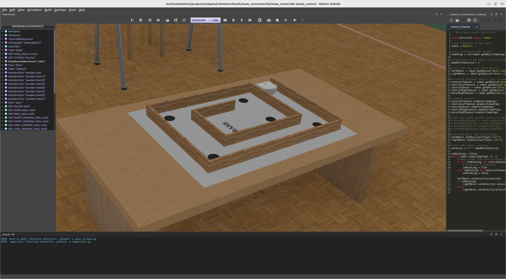

<!-- _class: titlepage -->


<div class="title">El entorno de simulación Webots</div>
<div class="subtitle">Robótica</div>
<div class="author">Alberto Díaz y Raúl Lara</div>
<div class="date">Curso 2022/2023</div>
<div class="organization">Departamento de Sistemas Informáticos</div>

[](https://creativecommons.org/licenses/by-nc-sa/4.0/)

---

# ¿Qué es Webots<sup>1</sup>?

Plataforma para la simulación de robots en entornos físicos:

- <i>Open Software</i>, publicado bajo los términos de la licencia [Apache License 2.0](https://www.apache.org/licenses/LICENSE-2.0).
- Muy utilizado por la industria, la educación, la investigación y otros campos.

Entorno completo de modelado, programación y simulación para prototipado:

- Creación de mundos [realistas](https://cyberbotics.com/doc/guide/appearances) con características físicas como masa o fricción.
- [Objetos pasivos simples](https://cyberbotics.com/doc/guide/objects) u objetos activos llamados [robots](https://cyberbotics.com/doc/guide/robots).
- Ofrece diferentes esquemas de movilidad (e.g. ruedas, patas o voladores)
- Múltiples [sensores](https://cyberbotics.com/doc/guide/sensors) (e.g. cámaras) y [actuadores](https://cyberbotics.com/doc/guide/actuators) (e.g. motores).

> <sup>1</sup> Sitio web oficial: <https://www.cyberbotics.com/>.  
> <sup>2</sup> Concretamente desde diciembre de 2018, desde la publicación de la versión [R2019a](https://www.cyberbotics.com/doc/blog/Webots-2019-a-release).

---

# Algunos términos comunes

**Mundo**: Fichero que contiene las descripciones de los robots y su entorno.

**Controlador**: Programa con el código que controla cualquier robot del mundo.

**Controlador supervisor**: Aquel que permite funciones de administración.

**Nodo**: Cada objeto existente en el escenario o mundo.

**Campo**, propiedad o característica: campo variable en el nodo.

---

# Instalación del simulador

En Windows, basta con descargar el instalador de la última versión y lanzarlo.

En macOS, dos opciones:

- Descargar el fichero de instalación `.dmg` de la aplicación e instalar.
- Instalar a través de <i>homebrew</i>.

En GNU/Linux, varias opciones:

- **Añadiendo el repositorio como fuente adicional del APT (recomendado).**
- Desde un <i>tarball</i> (`.tar.bz2`) o un paquete `.deb` en el caso de Debian.
- Instalando el paquete disponible en `snap`.

> Existen también contenedores de docker y servidor para, por ejemplo, el lanzamiento de simulaciones <i>headless</i>.

---

# Un vistazo a la interfaz<!--_class: transition-->

---



---

# Interfaz de Webots

**Barra de menú**: Accesos a todos los aspectos de la aplicación.

**Barra de herramientas principal**: Trabajo sobre la simulación

**Árbol de escena**: Información jerárquica acerca del mundo, objetos y robots.

- `Worldinfo`: Parámetros como el paso de simulación y la gravedad.
- `Viewpoint`: Parámetros relacionados con la perspectiva de visualización.
- **Editor de dominio**: Modificación de caracteristicas del nodo seleccionado.

**Pantalla de simulación**: Ventana para la visualización de la simulación.

**Editor de texto**: Sirve para editar los controladores de los robots.

**Consola**: Salida estándar para los controladores que estén funcionando

---

# Jerarquía de archivos en un proyecto<!--_class: transition-->

---

# Estructura base de directorios

https://cyberbotics.com/doc/guide/the-standard-file-hierarchy-of-a-project


Un proyecto es un directorio con, al menos, un directorio denominado `world/`

- Contiene ficheros de descripción de mundo (`.wbt`) y archivos del proyecto
- **Deberá incluir al menos** un fichero con extensión `.wbt`
- Puede incluir un directorio `textures\` con las texturas a utilizar

Ahora bien, normalmente son necesarios más directorios; estos son:

- `controllers/`: Fuentes para el control de robots.
- `libraries/`: Posibles bibliotecas externas en el proyecto.
- `plugins/`: Plugins para alterar el comportamiento típico de la simulación
- `protos/`: Prototipos disponibles para todos los ficheros del proyecto.

---

# Ficheros asociados a un mundo

Cada mundo (e.g. `world.wbt`) lleva asociados los siguientes ficheros ocultos:

- `.world.wbproj`: Información sobre la UI del usuario (e.g. perspectiva).
- `.world.jpg`: Imagen de carga de 768x432 en simulaciones o animaciones.

Si no existen o se eliminan, se crean al guardar correctamente el mundo.

---

# El directorio `controllers/`

Contiene un **directorio por cada posible controlador** de la simulación:

- El `.wbt` contiene el nombre del controlador a iniciarse para cada robot.
- Ese nombre hace referencia al **directorio del controlador**
- Es un campo independiente de plataforma y lenguaje (sólo es una cadena)

Cuando Webots intenta inicializar un controlador sigue el siguiente proceso:

1. Busca en `controllers/` un directorio que coincida con el nombre indicado
1. Busca en el subdirectorio un fichero que coincida con el nombre indicado
1. Si hay varios, selecciona uno de ellos siguiendo el siguiente orden:
   ```bash
   [.exe] > .class > .jar > .bsg > .py > .m
   ```
1. Si no encuentra ninguno, lanzará un error y iniciará un controlador vacío

---

# Nodos<!--_class: transition-->

---

Los diferentes objetos que pueblan un mundo se denominan **nodos**


Un Mundo es un archivo que contiene información como dónde están los objetos, qué aspecto tienen, cómo interactúan entre sí, cuál es el color del cielo, cómo se define la gravedad, la fricción, las masas de los objetos, etc. Define el estado inicial de una simulación. Los diferentes objetos se denominan Nodos y se organizan jerárquicamente en un Árbol de Escena. Por lo tanto, un nodo puede contener subnodos. Un mundo se almacena en un archivo con la extensión .wbt. El formato del archivo se deriva del lenguaje VRML97, y es legible para el ser humano. Los archivos de mundo deben ser almacenados directamente en un directorio llamado worlds.

---

# ¡GRACIAS!<!--_class: transition-->
