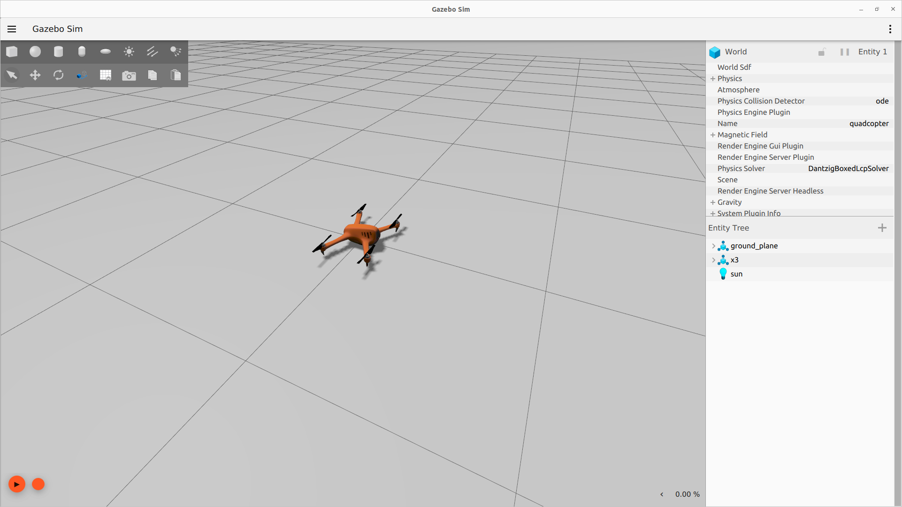
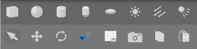

<style>

   .cite-author {
      text-align        : right;
   }
   .cite-author:after {
      color             : orangered;
      font-size         : 125%;
      font-weight       : bold;
      font-family       : Cambria, Cochin, Georgia, Times, 'Times New Roman', serif;
      padding-right     : 130px;
   }
   .cite-author[data-text]:after {
      content           : " - "attr(data-text) " - ";
   }

   .cite-author p {
      padding-bottom : 40px
   }

</style>

<!-- _class: titlepage -->


<div class="title">El entorno de simulación Gazebo</div>
<div class="subtitle">Robótica</div>
<div class="author">Alberto Díaz y Raúl Lara</div>
<div class="date">Curso 2022/2023</div>
<div class="organization">Departamento de Sistemas Informáticos</div>

[](https://creativecommons.org/licenses/by-nc-sa/4.0/)

---
  
# Contenidos

<!-- _class: cool-list -->

1. *Introducción*
1. *Creación de modelos simples*

---

<!--
   _class: transition
-->

# Introducción

---

# ¿Qué es Gazebo?

Gazebo es una aplicación para la simulación 3D de aplicaciones robóticas

- Está provisto de un motor físico altamente detallado
- Ofrece un gran conjunto de sensores e interfaces

Se usa típicamente para el diseño de robots:

- Principalmente diseño físico 
- Se integra con ROS, por lo que el diseño se extiende a la aplicaciónes enteras

---

# Instalación (en Ubuntu GNU/Linux)

1. Actualizamos los fuentes e instalamos las dependencias:
   ```bash
   $ sudo apt update && sudo apt install -y lsb-release wget gnupg
   ```

1. Añadimos los fuentes del repositorio oficial de gazebo:
   ```bash
   $ sudo wget https://packages.osrfoundation.org/gazebo.gpg \
         -O /usr/share/keyrings/ pkgs-osrf-archive-keyring.gpg
   $ echo "deb [arch=$(dpkg --print-architecture)\
           signed-by=/usr/share/keyrings/pkgs-osrf-archive-keyring.gpg]\ 
           http://packages.osrfoundation.org/gazebo/ubuntu-stable $(lsb_release -cs) main" \
     | sudo tee /etc/apt/sources.list.d/gazebo-stable.list > /dev/null
   ```

1. Instalamos la última versión, que en octubre de 2022 es Gazebo Garden
   ```bash
   $ sudo apt update && sudo apt install -y gz-garden
   ```

> <sup>1</sup> También existe en los repositorios de Ubuntu para instalar desde `apt`, pero se trata de una versión antigüa y en desuso, así que mejor evitarla.

---

# Un vistazo a la GUI



---


---


# Barra de herramientas

Situada en la parte superior de la ventana de la aplicación


Cuenta básicamente con dos botones:

1. Menú de **archivo** (izquierda)
   - Cargar/salvar escenario
   - Preferencias
   - ...
2. Menú de **complementos** (derecha)
   - Para cargarlos en el panel derecho
   - Incluye algunos tan útiles como el comparador de escala con plátanos

---

# Manipulación y creación de objetos

Esta barra de herramientas se encuentra en la parte superior izquierda

<center>


</center>

Se encarga de dos tareas básicas:

1. **Creación** de objetos (sección superior), como formas o luces
   - Al hacer click en el objeto se creará al nivel del suelo
1. **Manipulación** de objetos y escenario (sección inferior)

Todo objeto creado aparecerá en el <i>árbol de entidades</i> del panel derecho

---

# Un vistazo a la GUI


---

**Escena**: Donde los objetos (modelos) se diseñan e interactúan con el entorno

**Panel izquierdo**: Gestión de los modelos del entorno

- <i>World</i>: Listado de los modelos que actualmente forman parte de la escena
- <i>Insert</i>: Para añadir nuevos objetos a la simulación
- <i>Layers</i>: Para organizar los objetos de la simulación en grupos de visualización

**Panel derecho**: Interacción con las partes móviles del modelo seleccionado

- Aparece oculto por defecto

**Controles de escenario**: En la parte superior, para mover, rotar, etcétera

**Controles de simulación**: Para consultar y gestionar la simulación

---

<!--
   _class: transition
-->

# Creación de modelos simples

---

# Editor de modelos

Es la herramienta de Gazebo para construir objetos

- Permite construir modelos **simples**
- Permite cargar modelos en formato `.sdf` desarrollados en herramientas externas (e.g. [Blender](https://www.blender.org/)<sup>1</sup>)
- La OSRF dispone de un [repositorio de modelos](https://github.com/osrf/gazebo_models)<sup>2</sup> para su uso en Gazebo

Se accede desde el menú superior, en `Edit->Model Editor` (`CTRL+M`)

- Las físicas (y la simulación) se detendrán mientras estemos en el editor
- El panel izquierdo pasa a tener opciones de crear y editar objetos 3D

> <sup>1</sup> <https://www.blender.org/>
> <sup>2</sup> <https://github.com/osrf/gazebo_models>
---

<!--
   _class: transition
-->

# ¡GRACIAS!
