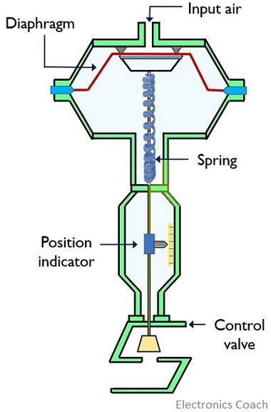
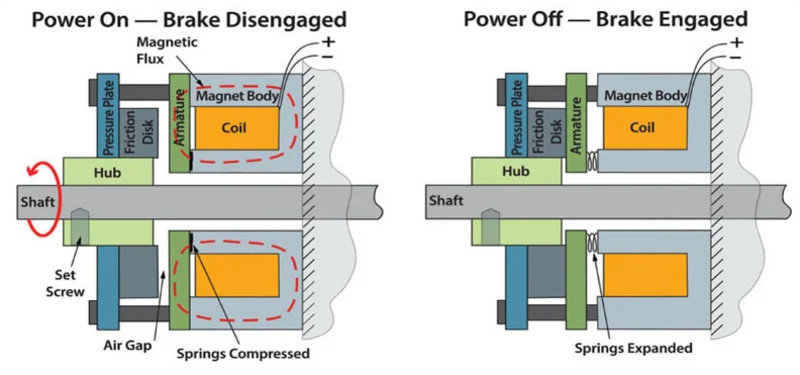
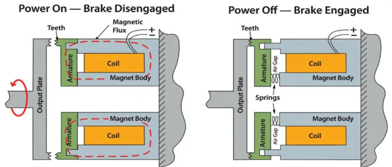
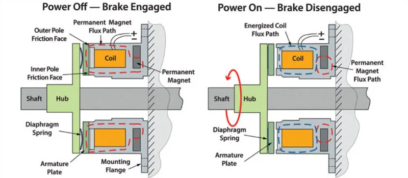

<!-- _class: titlepage -->

Actuación sobre el entorno

Robótica

Alberto Díaz y Raúl Lara

Curso 2022/2023

Departamento de Sistemas Informáticos

---

# Definición y tipos de actuadores

Dispositivos electromecánicos que **convierten energía en trabajo mecánico**.

- Trabajo mecánico: **Energía** que modifica el **movimiento** de un objeto.
- Es decir, puede ser para inducir u oponerse al movimiento de algo.
- La mayoría obtiene la energía de electricidad o presión de aire/fluidos.

Hay diferentes tipos de actuadores disponibles y la mayoría de ellos crean:

- Movimiento **lineal**
- Movimiento **rotacional**

El movimiento oscilatorio también es posible, pero es menos común.

---

# Actuadores neumáticos

Utilizan **aire comprimido** para moverse.

Son muy rápidos, tienen una alta fuerza de empuje, fáciles de de controlar y son muy precisos. Además, son muy fáciles de instalar y muy baratos.

Constan de un cilindro, un pistón, un diafragma, y un muelle.

El aire comprimido se introduce en el cilindro a través del diafragma, y el pistón se mueve hacia adelante. Cuando el aire se libera, el muelle empuja el pistón hacia atrás.

---

<video controls width=100% src="https://drive.upm.es/s/B9HKKWPHI4DjWHZ/download"></video>

---

# Actuadores hidráulicos

Utilizan **fluidos** para moverse.

Son más lentos que los actuadores neumáticos, pero tienen una alta fuerza de empuje. Comparten el resto de ventajas con los actuadores neumáticos.

El funcionamiento y los componentes son similares a los actuadores neumáticos.

Se utilizan principalmente para sistemas que requieren **una fuerza muy grande** (e.g. brazo de retroexcavadora), pero no muy restrictiva en cuanto a posicionamiento y precisión.

---

# Actuadores eléctricos

Utilizan **electricidad** para generar el movimiento.

- *Actuadores de efecto hall*: basados en el efecto hall (campo magnético al pasar una corriente a través de un conductor). **Fuerzas pequeñas**, pero con una **alta precisión**.

- *Actuadores de efecto magnético*: basados en el efecto magnético, que produce una fuerza sobre un conductor cuando se le aplica un campo magnético. **Fuerzas grandes**.

- *Actuadores de efecto piezoeléctrico*: basados en el efecto piezoeléctrico, que produce un cambio de forma en un cristal cuando se le aplica una tensión eléctrica. **Fuerzas muy pequeñas**, pero con una **alta precisión**.

---

# Solenoides

Utilizan el **efecto magnético** para moverse.

El solenoide está formado por una bobina y un núcleo ferroso móvil que convierte la energía eléctrica en energía mecánica creando un movimiento lineal.

Cuando la electricidad fluye a través de una bobina, crea un campo magnético y tira del pistón ferroso (de hierro o acero) hacia ella. Se pueden utilizar varias bobinas para devolver el pistón a su posición original.

---

<video controls width=100% src="https://drive.upm.es/s/X2ufUyH91LLECDE/download"></video>

---

# Motores eléctricos

Se basan en el **principio del electromagnetismo**.

Se compone de un **rotor** y un **estator**. El **rotor** es un electro-imán móvil que gira alrededor del eje del motor. El **estator** es un conjunto de imanes fijos que rodean al rotor.

Cuando se aplica una corriente eléctrica al rotor, se crea un campo magnético que provoca que el rotor gire alrededor del eje del motor.

La fuerza de empuje del rotor se puede controlar variando la intensidad de la corriente.

---

# Clasificación de motores eléctricos

No veremos todos, sino únicamente lo más relevantes

---

# Motores de corriente alterna (AC)

Motores eléctricos que utilizan corriente alterna para funcionar.

Se clasifican según el número de fases:

- **Monofase**: Una única fase
- **Multifase**: dos o más fases (los más usados en la industria son de tres fases).

Inventados por Nikola Tesla, son **más fáciles de controlar** que los de corriente continua, pero **más caros** y **menos eficientes**.

---

# Motores de corriente continua (DC)

Motor rotativo que convierte la energía eléctrica continua en energía mecánica.

Casi todos los tipos de motores de corriente continua tienen algún mecanismo interno, electromecánico o electrónico, para cambiar periódicamente la dirección de la corriente en una parte del motor.

La velocidad de un motor de corriente continua puede controlarse en un amplio rango, utilizando una tensión de alimentación variable o cambiando la intensidad de la corriente en sus bobinas de campo.

---

# Motores DC de escobillas

En un motor de corriente continua con escobillas, el rotor tiene imanes permanentes y el estator tiene electroimanes.

Como el motor necesita una forma de detectar la orientación del rotor, utiliza escobillas como conmutador, que es una pieza del rotor que toca el eje.

Cuando el rotor gira (a su vez, la escobilla gira), detecta el cambio de orientación e invierte la corriente.

Estos motores pueden girar a velocidades muy altas, pero con un torque muy bajo. Podemos mejorar el torque conectando el rotor a un reductor (sistema de engranajes).

---

# Motores DC sin escobillas

En un motor sin escobillas, el rotor es de imán permanente y el estator es de electroimán.

Para detectar un cambio de orientación, los motores sin escobillas suelen utilizar sensores de efecto Hall para detectar el campo magnético del rotor y consecutivamente su orientación.

Los motores sin escobillas son muy útiles en los robots, ya que son más capaces; proporcionan un par suficiente, y mayores velocidades que los motores con escobillas.

Los motores sin escobillas son caros debido a la complejidad de su diseño y necesitan un controlador para controlar su velocidad y rotación.

---

<video controls width=100% src="https://drive.upm.es/s/RzeukxzUBitlS2X/download"></video>

---

# Servomotores

Motores de corriente continua acoplados a:

- Circuito de control de retroalimentación.
- Sistema de engranajes para aumentar el par.
- Dispositivo de detección de posición (normalmente un potenciómetro).

Al recibir una señal (pulso de control), el eje se desplaza hasta la posición indicada utilizando la retroalimentación de posición de un potenciómetro.

**No presentan rotación continua**:

- Están limitados a un rango específico (generalmente ±200°).

Poseen tres cables: tierra, potencia y **pulso de control**.

---

<video controls width=100% src="https://drive.upm.es/s/aKLcTvC2C60vRrZ/download"></video>

---

# Motores paso a paso

Motor eléctrico de **corriente continua sin escobillas** que divide una rotación completa en un número de pasos iguales.

La posición del motor puede controlarse para que se mueva y se mantenga en uno de estos pasos sin ningún sensor de posición.

Son **muy precisos** y tienen un **par de torsión muy alto**, pero son más **lentos** que los servos.

Debido a su precisión, se usan en aplicaciones como impresoras 3D, máquinas de coser, máquinas de grabado láser, etc.

---

<video controls width=100% src="https://drive.upm.es/s/18iIU40iVRL2FBY/download"></video>

---

# Motores lineales

Motor eléctrico al que se le ha "desenrollado" el estator y el rotor, por lo que, en lugar de producir un par (rotación), produce una fuerza lineal a lo largo de su longitud.

**No son necesariamente rectos**. La sección activa de un motor lineal suele tener extremos, mientras que los motores más convencionales están dispuestos en forma de bucle continuo.

Suelen emplearse en aplicaciones de alta precisión.

---

<video controls width=100% src="https://drive.upm.es/s/peejQ4o8X1CSGZL/download"></video>

---

# LED (Light-Emitting Diode)

Dispositivo semiconductor que emite luz cuando se le aplica una tensión.

Se puede utilizar para indicar el estado de un robot, iluminar el entorno, etc.

Algunos pueden emitir una luz de color diferente, dependiendo de la tensión aplicada. Lo normal es que emitan luz del mismo color.

Dado que pueden alternar su estado millones de veces por segundo **pueden usarse como** un **mecanismo de comunicación** con un elevado ancho de banda.

---

# Pantalla LCD

Una pantalla LCD es un dispositivo que muestra información en una pantalla de cristal líquido.

Son muy populares en los robots, ya que son baratas, fáciles de usar y tienen un alto contraste.

Las pantallas LCD se pueden usar para mostrar información, como el estado de un robot, el tiempo restante, etc.

Las últimas pantallas LCD son táctiles, lo que permite al usuario interactuar con el robot. Además tienen resoluciones muy altas y son capaces de mostrar imágenes y vídeos en color.

---

# Dispositivos de frenado

Los frenos más comúnmente utilizados en aplicaciones robóticas se pueden clasificar como de **muelle** o de **imán permanente**. Además, los frenos de muelle se clasifican como **frenos de disco** o **frenos dentados**.

Dependiendo del estado del freno, la bobina atrae o repele el mecanismo de fricción

 

> Fuente: TechBriefs.com

---

<video controls width=100% src="https://drive.upm.es/s/f6bq2GPB4lonH75/download"></video>

---

<video controls width=100% src="https://drive.upm.es/s/Vn629GTVxvfaZyB/download"></video>

---

# Dispositivos de frenado

En el caso de los imanes permanentes, el freno se activa cuando el imán se acerca al mecanismo de fricción.

El movimiento se controla con una bobina que provoca un campo magnético.

> Fuente: TechBriefs.com

---

<video controls width=100% src="https://drive.upm.es/s/awhSAUpepf5EIwI/download"></video>

---

# Músculos artificiales

Dispositivos (o materiales) que imitan el músculo natural:

- Dado un estímulo externo, pueden cambiar su rigidez, expansión/contracción o su torsión
- También denominados **actuadores de tipo muscular**

Las **tres respuestas básicas** (contracción, expansión y rotación) pueden **combinarse** dentro de un mismo componente **para producir otros movimientos** (e.g. la flexión, contrayendo un lado del material mientras se expande el otro).

---

<video controls width=100% src="https://drive.upm.es/s/3kg5fadUeha4CeQ/download"></video>

---

# Actuadores disponibles en Webots

Webots provee de abstracciones de estos y otros actuadores, por ejemplo:

- [Altavoz](https://cyberbotics.com/doc/reference/speaker): Simula emisión de sonido
- [Bolígrafo](https://cyberbotics.com/doc/reference/pen): Simula un dispositivo de pintado
- [Emisor](https://cyberbotics.com/doc/reference/emitter): Simula envío de datos a través de radio, serie o infrarrojos
- [Freno](https://cyberbotics.com/doc/reference/brake): Simulación de frenado mecánico
- [Hélice](https://cyberbotics.com/doc/reference/propeller)
- [LED](https://cyberbotics.com/doc/reference/led)
- [Motor lineal](https://cyberbotics.com/doc/reference/linearmotor)
- [Motor rotativo](https://cyberbotics.com/doc/reference/rotationalmotor)
- [Muśculo](https://cyberbotics.com/doc/reference/muscle): Simula un músculo artificial
- [Pantalla](https://cyberbotics.com/doc/reference/display)

---

# Gracias<!--_class: transition-->
