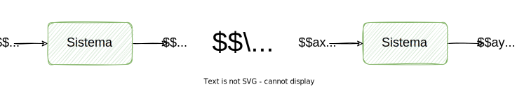
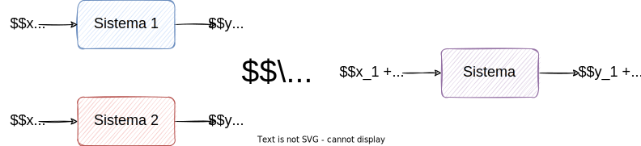
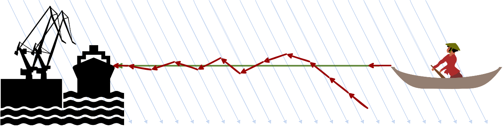

<!-- _class: titlepage -->

Introducción rápida a los sistemas de control

Robótica

Alberto Díaz y Raúl Lara

Curso 2022/2023

Departamento de Sistemas Informáticos

---

# La teoría del control

Se ocupa del **control de sistemas dinámicos** en procesos de todo tipo.

- Se considera campo interdisciplinario de la ingeniería y de las matemáticas.

¿Cómo **llevar sistemas a estados deseados** en función de sus entradas ...

- ... **minimizando** el **tiempo** de ajuste, rebasamiento y error estacionario?
- ... **garantizando** un nivel de **estabilidad** de control?
- ... **persiguiendo** el grado de **optimalidad**?

Por cierto, las entradas también reciben nombre de **referencia**.

---

Dentro de la teoría de control existen también otros dos aspectos de estudio:

- **Controlabilidad**: Alterar un sistema usando solo manipulaciones admisibles.
- **Observabilidad**: Medida de lo bien que se infieren los estados internos de un sistema a partir del conocimiento de sus salidas externas.

Existen dos grandes divisiones en la teoría de control, a saber:

- **Clásica**: Diseño de sistemas de una única entrada y una única salida1.
- **Moderna**: Diseño de sistemas con múltiples entradas y salidas.

> Excepto cuando se analiza el impacto de perturbaciones, donde sí se utiliza una segunda entrada.

---

# Función de transferencia

Función que **modela la salida** de un sistema **para cada entrada posible**2.

El caso más sencillo ofrece una entrada para una salida:

- La gráfica generada se denomina **curva de transferencia**.
- Muy común en áreas como tratamiento de señal o teoría de la comunicación.

Se suele utilizar sólo en sistemas lineales invariantes en el tiempo (LTI):

- La mayoría de sistemas tienen características de entrada/salida no lineales.
- Suelen comportarse linealmente dentro de sus parámetros "normales".

> Modelización **teórica**, por lo que no tiene por qué replicar exactamente todos los detalles del sistema modelado.

---

# Ingeniería automática

Puede definirse como la **aplicación práctica de la Teoría del control**.

Sus objetivos fundamentales son:

1. **Modelado** de sistemas dinámicos en términos de entradas y salidas.
2. **Diseño** de controladores para regular el comportamiento de dichos sistemas.
3. **Implementación** de controladores empleando la tecnología disponible.

Se suele considerar subcampo de la Ingeniería eléctrica:

- Pero sólo porque muchos controladores son eléctricos.
- En realidad no tiene por qué, también existen controladores mecánicos.
- Incluso hay sistemas <i>software</i> controlados por controladores Software.

---

# Sistemas de control (controladores)

**Regulan** el **comportamiento** de otros sistemas mediante bucles de control.

**Sistema de control automático**: Diseñado para funcionar sin intervención.

---

# Error y rebasamiento en un controlador

**Error**: Diferencia entre estado actual y estado deseado de un sistema.

**Rebasamiento**: Magnitud o dirección cuando el estado supera el <i>set point</i>.

Ambos son dos tipos de divergencias. Pueden ofrecer diferente información:

- **Existe/no existe** error: La menor cantidad de información.
- **Dirección**: Hacia dónde hay que ir para minimizar el error.
- **Magnitud**: La distancia al estado objetivo.

Controlar un sistema es mejor cuando conocemos dirección y magnitud.

---

# Clasificación según anticipación a la salida

Punto de vista respecto la relación entre salida y los valores actual y pasados.

**Causales**: La salida es consecuencia del valor actual y pasado de la entrada.

- Son con los que trabajaremos normalmente porque modelan sistemas reales

**No causales**: No es posible determinar la salida en función de la entrada.

- No existen físicamente, son representaciones abstractas

> Estos controladores se diseñan de tal manera que la salida depende de valores futuros de la entrada.

---

# Clasificación según número de entradas y salidas

Clasificación sencilla en función de si hay una o muchas entradas o salidas:

- **SISO** (Single input, single output)
- **SIMO** (Single input, multipe output)
- **MISO** (Multiple input, single output)
- **MIMO** (Multiple input, multiple output)

---

# Clasificación según función de transferencia

Un sistema es lineal si su función característica cumple los principios de:

## Homogeneidad

## Superposición

Por tanto el controlador se denominará:

- **Lineal**: Si cumple ambos principios de superposición y homogeneidad.
- **No lineal**: Si no cumple al menos uno de ellos.

---

# Clasificación según paso del tiempo

Otro punto de vista: ¿cómo se modela el paso del tiempo en un sistema?:

- De **tiempo continuo**: El tiempo evoluciona de manera continua.
- De **tiempo discreto**: El tiempo evoluciona de manera discreta.
- De **eventos discretos**: La tiempo evoluciona cuando ocurren ciertos eventos.

---

# Clasificación según relación entre las variables de entrada

Cuando hablamos de varios controladores, estos se pueden clasificar como:

- **Acoplados**: Si las variables de ambos están relacionadas entre sí.
- **Desacoplados**: Si no lo están.

---

# Clasificación según evolución de parámetros internos

Los controladores mantienen parámetros que modulan su respuesta.

Así diferenciamos dos tipos de controladores:

- **Estacionarios**: Los parámetros no varían durante su funcionamiento.
- **No estacionarios**: Los parámetros pueden variar a lo largo del tiempo.

---

# Clasificación según respuesta del sistema

La salida de un sistema petenece a un dominio, por lo que podemos clasificarlos:

- **Estables**: Para toda entrada acotada la respuesta es acotada.
- **Inestables**: Al menos una entrada acotada produce una salida no acotada.

---

# Clasificación según realimentación

**Realimentación**: Relación secuencial de causas y efectos entre variables.

- O de otro modo, cuando una o más variables de salida se pasan a la entrada.
- También se la conoce como **retroalimentación** o <i>**feedback**</i>.
- Concepto muy antiguo, aunque fue formalizado por Norbert Wiener en 1948.

Dependiendo de la acción correctiva que tome el sistema:

- Si es apoyar la salida: Realimentación positiva o "efecto bola de nieve".
- En caso contrario: Realimentación negativa o regulación autocompensatoria.

Dos tipos, de **lazo cerrado** y de **lazo abierto**

---

# Control de lazo cerrado

Cuando se usa la realimentación para minimizar el error de la salida.

- El controlador usa el <i>feedback</i> para conocer en cada momento la salida real.

El <i>feedback</i> provee al controlador de un comportamiento correctivo:

1. El controlador monitoriza una variable de salida (PV, de <i>Process Variable</i>).
2. La compara con la referencia, consigna o punto de ajuste (SP, de <i>set point</i>).
3. $SP-PV$ da lugar a la **señal de error**, que es la salida a minimizar

Ejemplos de estos sistemas de control:

- Convergencia fonética de un humano.
- Control de crucero de un vehículo.

---

# Control de lazo abierto

Aquellos controladores que no tienen en cuenta su influencia en el entorno.

Ejemplos de estos sistemas de control:

- Tostadora (las hay que comprueban el color de la rebanada).
- Secadora estándar (las hay que comprueban la humedad del tambor de secado).

---

# Controladores de lazo abierto vs. lazo cerrado

## Lazo abierto

### Ventajas

- Sencillos, de fácil mantenimiento

### Inconvenientes

- Requieren calibración inicial
- Sensibles a perturbaciones
- Mejor en modelos simples

## Lazo cerrado

### Ventajas

- Control de sistemas inestables
- Robustez frente perturbaciones

### Inconvenientes

- Mayor coste (más sensores)
- Son más complejos de modelar

---

# Clasificación según predictibilidad

En función de lo predecible de la respuesta de un sistema, lo podemos clasificar como:

- **Determinista**: Si su comportamiento es extremadamente predecible.
- **Estocástico**: Si es imposible predecir su comportamiento futuro.

---

# Cibernética<!--_class: transition-->

---

# Etimología

La palabra timonel (en inglés <i>steersman</i>) viene el griego antiguo <i>kybernetes</i>:

- Los romanos la usaron para su <i>gubernare</i> (no eran muy buenos navegando).
- Norbert Wiener tomó la palabra griega y le añadió el sufijo <i>ics</i>3

Podemos definir la **cibernética** como el **arte de** gobernar o **controlar**.

> 3 En realidad remplazó el sufijo -tes (actor, agente) por -ike (disciplina, práctica, actividad), pasando de κυβερνήτης (kybernetes) a κυβερνητική (kybernetike). Disculpas por anticipado a todo estudiante de griego clásico.

---

# Sistema de control genérico

Desde el punto de vista de la cibernética, un sistema tiene la siguiente forma:

Generalmente son bucles de control con realimentación

- Realimentación positiva o negativa (de ahí el $\pm$ en la generación del input).
- Puede haber sistemas de lazo abierto, pero no suelen ser de interés aquí.

---

# Componentes más importantes de la cibernética

**Realimentación**: Mejora el rendimiento dinámico del sistema.

- Es un principio muy general que abarca tecnología, astronomía, biología, ...

**Información**: Flujos de datos que rodean un sistema.

**Modelo**: Basada en que existe isomorfismo5 entre diferentes sistemas.

**Ley de Ashby**6: <i>"cuanto mayor es la variedad de acciones, mayor es la variedad de perturbaciones a controlar"</i>.

- Sólo podemos controlar cuando sistema y controlador comparten  variedad.

> 4 Fue definida por <i>Shannon</i> como la cantidad de incertidumbre eliminada que se describe probabilísticamente.  
> 5 Sistemas mecánicos, electrónicos, etc. se pueden describir mediante las mismas ecuaciones diferenciales.  
> 6 En algunos contextos se conoce como la **Ley de la Variedad Requerida**.

---

# ¡GRACIAS!<!--_class: transition-->
