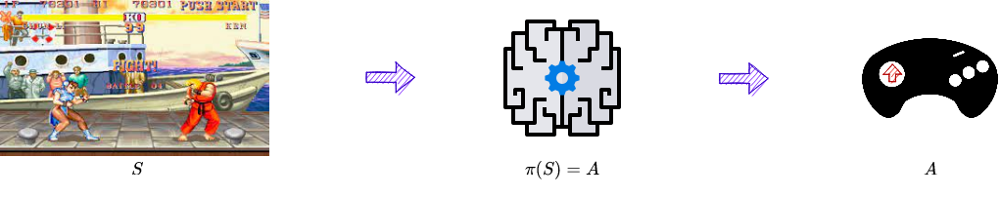
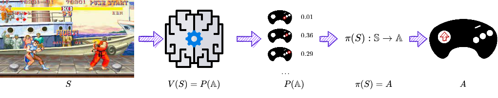

<!-- _class: titlepage -->

Optimización mediante aprendizaje por refuerzo

Robótica

Alberto Díaz y Raúl Lara

Curso 2022/2023

Departamento de Sistemas Informáticos

---

# Introducción<!--_class: transition-->

---

# Paradigmas de aprendizaje en <i>Machine Learning</i>

**Supervisado**: Se aprende de ejemplos con sus correspondientes respuestas.

- Problemas de regresión y clasificación.

**No supervisado**: Búsqueda de patrones en datos no etiquetados.

- Problemas de <i>clustering</i>, reducción de la dimensionalidad, recodificación, ...

**Por refuerzo**: Se aprende a través de la experiencia a base de recompensas.

- Problemas de aprendizaje de políticas de decisión.
- No se le presentan ejemplos-respuestas
- La evaluación del sistema es concurrente con el aprendizaje.

---

<!-- _class: cite -->

   "Las respuestas que producen un efecto positivo en una situación concreta aumentan la probabilidad de repetirse en dicha situación, mientras que las que producen un efecto negativo la reducen."

---

# Caja de Skinner

Experimento desarrollado en 1938 por Burrus F. Skinner.

- También **cámara del condicionamiento operante**.
- ¿Animal realiza acción deseada? Recompensa
- ¿No? Penalización

Se vio que algunos comportamientos de aprendizaje son bucles observación-acción-recompensa

---

# Aprendizaje por refuerzo (RL)

Área del <i>machine learning</i> donde **los agentes aprenden interactuando**:

- **Imita** de manera fundamental el **aprendizaje** de muchos **seres vivos**.
- Esa interacción produce tanto resultados deseados como no deseados.
- Se entrena con la **recompensa o castigo** determinados para dicho resultado.
- El agente tratará de maximizar la recompensa a largo plazo.

Se utiliza principalmente en dos áreas hoy en día:

- **Juegos**: Los agentes aprenden las reglas y las jugadas jugando1.
- **Control**: Los agentes aprenden en entornos de simulación las mejores políticas de control para un problema determinado.

> 1 Un ejemplo curioso es el publicado en <https://www.nature.com/articles/nature14236>, donde describen cómo un agente aprende a jugar a 49 juegos de Atari 2600 llegando a un nivel de destreza comparable al humano.

---

# Terminología

**Agente inteligente** (agente, robot): Entidad que interactúa con el **entorno**.

Espacio de **estados** $S$ y de **observaciones** $O$: Información obtenida del entorno:

- **Estado** $s_t \in S$: Descripción **completa** del estado del entorno en un instante $t$.
- **Observación** $o_t \in O$: Descripción **parcial** del estado del entorno en un instante $t$.

**Espacio de acciones** $A$: Conjunto de acciones que puede realizar el agente:

- **Discreto**: El conjunto es finito (e.g. juego del Go).
- **Continuo**: El conjunto es infinito (e.g. vehículo autónomo).

**Conjunto de recompensas** $R$: Todas las recompensas que puede recibir un agente.

- $r_t \in R$: La recompensa recibida por el agente en un instante $t$.

---

# Ejemplo #1: Juego del Go

- Agente: Robot que juega al Go.
- Entorno/mundo: El tablero en el que se juega.
- Estado: Colocacion concreta de las piedras.
- Observación: Estado (sin información oculta).
- Espacio de acciones (finito): Poner piedra en una casilla vacía.

---

# Ejemplo #2: Warcraft II

- Agente: Robot que juega al Warcraft II.
- Entorno/mundo: Pantalla en la que se juega.
- Estado: Situación de la pantalla en un momento determinado.
- Observación: Lo que el agente ve en un instante determinado (sin la niebla de guerra).
- Espacio de acciones (finito): Mover unidades, construir edificios, ...

---

# Ejemplo #3: Coche autónomo

- Agente: Robot que conduce el vehículo.
- Entorno/mundo: El continente en el que se encuentra el vehículo.
- Estado: Estado del continente en un momento determinado.
- Observación: Lo que el agente ve por sus sensores en un instante determinado.
- Espacio de acciones (infinito): Girar el volante un determinado ángulo, aumentar y disminuir aceleración, ...

---

# Modelo de interacción agente-entorno

El proceso de aprendizaje por refuerzo es el siguiente:

1. El agente lee un estado $s_0$ del entorno.
2. De acuerdo a $s_0$, realiza la acción $a_0$.
3. El entorno pasa al nuevo estado $s_1$.
4. El agente recibe una recompensa $r_1$.
5. Iterar hasta encontrar estrategia óptima

Este bucle produce una secuencia de estados, acciones y recompensas:

$$s_0, a_0, r_1, s_1, a_1, \ldots$$

---

# <i>Markov Decision Processes</i> (MDP)<!--_class: transition-->

---

# Propiedad de Márkov

El estado futuro de un proceso depende del estado actual, y no de los anteriores.

- Es un estado que cumplen ciertos procesos estocásticos.
- Definida por Andréi Markov en 1906 en su Teoría de Cadenas de Márkov2.

Al proceso que satisface esta propiedad se denomina **Proceso de Márkov**.

- Concretamente se denominan Procesos de Márkov de **primer orden**.
- La definición se puede extender a $n$ estados anteriores (proceso de orden $n$).

Si hay que quedarse con algo, nos dice que nuestro agente sólo necesita el estado actual para decidir qué acción tomar.

> 2 Más información en <https://en.wikipedia.org/wiki/Markov_chain>.
---

# Procesos de decisión de Márkov (MDP)

Proceso **estocástico** de **tiempo discreto** que satisface la **propiedad de Márkov**.

Matemáticamente se define como una 4-tupla $(S, A, P_{a},R_{a})$ donde:

- $S$ y $A$: Espacios de estados y de acciones del proceso respectivamente.
- $P_{a}(s,s')$: Probabilidad de que la acción $a$ nos lleve de $s$ a $s'$.
- $R_{a}(s,s')$: Recompensa inmediata por pasar del estado $s$ al estado $s'$ con la acción $a$.

A la función $\pi: S \rightarrow A$ que define las políticas de decisión se le denomina <i>**policy**</i>.

---

# Diferencia entre un MDP y Cadena de Márkov

Los MDP extienden a las cadenas de Márkov en dos aspectos:

- Permiten elegir **acciones** para realizar transiciones entre estados.
- Incluyen **recompensas** a una o más de esas transiciones.

## Cadenas de Márkov

## MDP

---

# Tareas y problemas en aprendizaje por refuerzo

Se entiende por tarea a una instancia de un problema.

Tenemos dos tipos bien diferenciados de tareas:

- **Episódicas**: Poseen estado inicial y terminal o final (e.g. Sonic the Hedgehog).
- **Continuas**: Tarea que no posee estado terminal (e.g. vehículo autónomo).

Es importante de cara a las simulaciones para entrenar a los agentes:

- Una tarea episódica se puede reanudar cuando llega a un estado final.
- Una tarea continua no acaba nunca y es necesario decidir cuando se reinicia.

---

# Recompensas y tomas de decisiones<!--_class: transition-->

---

# Hipótesis de la recompensa

El agente quiere **maximizar la recompensa acumulada** (rendimiento esperado).

- Recompensa: <i>Feedback</i> que recibe el agente para saber si la acción es buena o no.

**Recompensa acumulada**: Suma de todas las recompensas de la secuencia.

$$ R(\tau) = \sum_{i=0}^\infty \gamma^i r_{t+i+1} = r_{t+1} + \gamma r_{t+2} + \gamma^2 r_{t+3} + \ldots$$

Sin embargo, las recompensas no tienen por qué tener todo su valor siempre.

- De ahí el **factor de ajuste** $\gamma \in [0, 1]$ que se le aplica a la recompensa.
- Las recompensas a corto plazo tienen más probabilidades de suceder.
- $\gamma$ indica si interesan más recompensas a **corto** ($\gamma \approx 0$)) o a **largo** ($\gamma \approx 1$) **plazo**.

---

# Función de politicas de decisión

La función de <i>policy</i> ($\pi$) es la que **asigna** una **acción** $a \in A$ a cada **estado** $s \in S$.

- Realiza el mapeo entre el espacio de estados y el de acciones.
- Define completamente el comportamiento de un agente.

Buscamos $\pi$ que **maximice el rendimiento esperado**; existen dos métodos:

- **Directo**: ¿Qué acción debe realizar en el estado actual?
- **Indirecto**: ¿Qué estados son mejores para tomar la acción que lleva a esos estados?

---

# Métodos directos (<i>policy learning</i>)

En estos métodos intentamos **aprender directamente la función $\pi$**.

## Determinista

Devuelve **siempre la misma acción** para un estado determinado.

$$\pi(S) = A$$

Por ejemplo:

$$\pi(s_t) = \{►\}$$

## No determinista

Devuelve una **distribución de probabilidad** sobre las acciones.

$$\pi(S) = P[A | S]$$

Por ejemplo:

$$\pi(s_i) = \{(◄, 0.3), (►, 0.5), (▼, 0.1), (▲, 0.1)\}$$

Para aprenderlas se suelen usar redes neuronales (no se verá en esta asignatura).

---

# Métodos indirectos (basados en valores)

Aprendemos una función $v_\pi$ (o $q_\pi$) que **relaciona un estado con su valor estimado**.

- Valor: Recompensa acumulada si empieza en ese estado y se mueve al mejor estado.
- El agente selecciona la acción de mayor valor.

## Valor estado

$$v_\pi(s_t) = E_\pi[r_{t+1} + \gamma v_\pi(s_{t+1})]$$

## Valor par estado-acción

$$q_\pi(s_t, a_t) = E_\pi[r_{t+1} + \gamma q_\pi(s_{t+1}, a_{t+1})]$$

Independientemente de la función elegida, el resultado será la recompensa esperada.

Por cierto, ¿cómo sabemos **qué acciones futuras son óptimas**?

- Spoiler: **No lo sabemos**, actuamos con lo que sabemos en cada momento.

---

# Estrategia $\epsilon$-greedy

Política sencilla para elegir acción que mantiene el equilibrio exploración/explotación.

- Una política basada en la aleatoriedad no da buenos resultados.
- Pero una basada en escoger siempre la mejor opción se estanca en mínimos locales.

La estrategia $\epsilon$-greedy es una **combinación de ambas**.

- Con probabilidad $\epsilon$ se escoge una acción aleatoria.
- Con probabilidad $1 - \epsilon$ se escoge la mejor acción.

Por ejemplo, si tenemos dos acciones (A y B), siendo A la mejor, con $\epsilon = 0.5$:

- Con probabilidad 0.5 se escoge A.
- Con probabilidad 0.5 se escoge aleatoriamente entre B y A.

---

# Comparativa entre métodos directos e indirectos

## Métodos directos

La **política óptima** se encuentra **entrenando** la política **directamente**.

## Métodos indirectos

Encontrar una **función de valor óptima** lleva a tener una **política óptima**.

Por lo tanto Independientemente del método, tendremos una política.

- Pero en el caso de los métodos basados en valores no la entrenamos.
- Será una "simple" función que usará los valores dados por la función $v_\pi$ o $q_\pi$.

---

# Q-learning

Técnica en la que se aprende una función (tabla) acción-valor o función $Q$:

- Entrada: Estado y acción a realizar.
- Salida: **Recompensa esperada** de esa acción (y de todas las posteriores).

La función $Q$ se actualiza de forma iterativa:

1. Antes de explorar el entorno, $Q$ da el mismo valor fijo (arbitrario).
2. Según se explora, aproxima mejor el valor de la acción $a$ en un estado $s$.
3. Según se avanza, la función $Q$ se actualiza.

Representa suma de las recompensas de elegir la acción $Q$ y todas las acciones óptimas posteriores.

---

$$Q(s_t, a_t) = Q(s_t, a_t) + \alpha \cdot (r_t + \gamma \max_a Q(s_{t+1}, a) - Q(s_t, a_t))$$

Realizar $a_t$ en el estado $s_t$ actualiza su valor con un término que contiene:

- $\alpha$: Lo "agresivo" que sstamos haciendo el entrenamiento.
- $r_t$: Estimación que obtuvimos al actuar en el estado $e_t$ anteriormente.
- $\max_a Q(s_{t+1}, a)$: Recompensa futura estimada (la que vamos aprendiendo).
- $\gamma \in [0, 1]$: El factor de ajuste que sube o baja la recompensa futura.
- Se resta además el valor antiguo para incrementar o disminuir la diferencia en la estimación.

Ahora tenemos una estimación de valor para cada par estado-acción.

- Con ella, podemos elegir la acción que nos interesa (e.g. usando $\epsilon$-greedy)

---

# Otras soluciones

## <i>Deep $Q$-networks</i> (DQN)

Son aproximaciones de funciones $Q$ utilizando redes neuronales profundas2.

## Asynchronous Advantage Actor-Critic (A3C)

Es una combinación de las dos técnicas anteriores3, combinando:

- Un actor: Red de políticas de actuación que deciden qué acción tomar.
- Un crítico: DQN que decide el valor de cada acción a tomar.

> 2 <https://www.nature.com/articles/nature14236>  
> 3 <https://proceedings.mlr.press/v48/mniha16.html>

---

<video controls width=100% src="https://drive.upm.es/s/0VIKqV7AiEQSzPu/download"></video>

---

# Relevancia del aprendizaje por refuerzo<!--_class: transition-->

---

<!-- _class: cite -->
 

   "El Go es un juego estudiado por los humanos durante más de 2500 años. AlphaZero, en un tiempo insignificante (3 días), pasó de conocer sólo las reglas del juego a vencer a los mejores jugadores del mundo, superando todo nuestro conocimiento acumulado durante milenios. Ningún campo del aprendizaje automático ha permitido avanzar tanto en este tipo de problemas como el aprendizaje por refuerzo."

---

# Relevancia del aprendizaje por refuerzo hoy en día

Podemos decir que es prácticamente el único paradigma de aprendizaje:

- Capaz de aprender comportamientos complejos en entornos complejos.
- Que ha podido hacerlo prácticamente sin supervisión humana.

Ofrece a la robótica forma abordar cómo diseñar comportamientos difíciles.

- Que por otro lado, son prácticamente todos.
- Las cosas fáciles para un humano suelen ser las más complejas de diseñar.

Permite a robots descubrir de forma autónoma comportamientos óptimos:

- No se detalla la solución al problema, sino que se interacciona con el entorno.
- La retroalimentación de el efecto sobre el entorno permite aprender.

---

# La utilidad de los modelos aproximados

Los datos del mundo real pueden usarse para aprender modelos aproximados.

- Mejor, porque el proceso de aprendizaje por ensayo y error es muy lento.
- Sobre todo en un sistema que tiene que hacerlo en un entorno físico.
- Las simulaciones suelen ser mucho más rápidas que el tiempo real.
- Y también mucho más seguras para el robot y el entorno
- <i>**Mental rehearsal**</i>: Describe el proceso de aprendizaje en simulación.

Suele ocurrir que un modelo aprende en simulación pero falla en la realidad:

- Esto se conoce como **sesgo de simulación**.
- Es análogo al sobreajuste en el aprendizaje supervisado.
- Se ha demostrado que puede abordarse introduciendo modelos estocásticos. <!-- Incluso si el sistema es muy cercano al determinismo. -->

---

# Impacto del conocimiento o información previa

El conocimiento previo puede ayudar a guiar el proceso de aprendizaje:

- Este enfoque reduce significativamente el espacio de búsqueda.
- Esto produce una **aceleración** dramática **en el proceso de aprendizaje**.
- También **reduce la posibilidad de encontrar mejores óptimos**1.

Existen dos técnicas principales para introducir conocimiento previo:

- A través de la **demostración**: Se da una política inicial semi-exitosa.
- A través de la **estructuración de la tarea**: Se da la tarea dividida.

> 1 Alpha Go fue entrenado con un conocimiento previo de Go, pero Alpha Go Zero no sabía nada del juego. El resultado fue que Alpha Go Zero jugó y ganó a Alpha Go en 100 partidas.
---

# Desafíos del aprendizaje por refuerzo

**La maldición de la dimensionalidad**: El espacio de búsqueda crece exponencialmente con el número de estados.

**La maldición del mundo real**: El mundo real es muy complejo y no se puede simular.

- Desgaste, estocasticidad, cambios de dinámica, intensidad de la luz, ...

**La maldición de la incertidumbre del modelo**: El modelo no es perfecto y no se puede simular.

- Cada pequeño error se acumula, haciendo que conseguir un modelo suficientemente preciso del robot y su entorno sea un reto

---

# Algunas reflexiones

Es probable que una IA más avanzada requieran recompensas más complejas.

- Por ejemplo, un vehículo autónomo al principio puede estar ligada a algo tan simple como "llegar del punto $a$ al punto $b$ a salvo", pero...
  - ¿Y si se ve obligado a elegir entre mantener el rumbo y atropellar a cinco peatones o desviarse y atropellar a uno?
  - ¿Debe desviarse o incluso dañar al conductor con una maniobra peligrosa?
  - ¿Y si el único peatón es un niño, o un anciano? ¿una mujer? ¿un hombre? ¿un transexual? ¿la próxima Marie Curie? ¿el próximo Hitler? ¿un cuadro valiosísimo e irremplazable? ¿cambia eso la decisión? ¿por qué?

De repente el problema es mucho más complejo al intentar matizar la función objetivo

---

Dentro de la ética moral, una de las principales preguntas es: **¿qué debemos hacer?**

- ¿Cómo debemos vivir? ¿Qué acciones son correctas o incorrectas?

Nosotros los humanos, ¿tenemos funciones de valor? ¿qué nos motiva?

- Porque ojo, hay conceptos más complicados que el placer y el dolor como el bien y el mal, el amor, la espiritualidad, ...
- ¿Se podría al menos esbozar la recompensa que maximizamos en nuestra vida real?

Y como humanos, ¿cómo sabemos lo que es correcto o no? ¿Por intuición?

- Generalmente podemos responder que estos valores nos vienen "por intuición".
- Seguramente, pero poner la en palabras o reglas es sencillamente imposible.
- Y **probablemente una máquina pueda aprender estos valores de alguna manera**.
- Probablemente esto es uno de los problemas más importantes que os tocará resolver.

---

# ¡GRACIAS!<!--_class: transition-->
