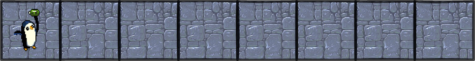
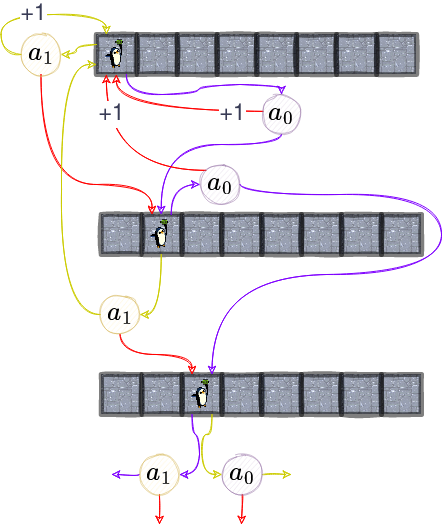

<!-- _class: titlepage -->


<div class="title">Aprendizaje por refuerzo</div>
<div class="subtitle">IA - Tema 4. Aprendizaje por refuerzo</div>
<div class="author">Alberto Díaz Álvarez <alberto.diaz@upm.es></div>
<div class="organization">Departamento de Sistemas Informáticos<br/>E.T.S.I. Ingeniería de Sistemas Informáticos</div>

[](https://creativecommons.org/licenses/by-nc-sa/4.0/)

---

# Introducción<!--_class: transition-->

---

# Paradigmas de aprendizaje en <i>Machine Learning</i>

**Supervisado**: Se aprende de ejemplos con sus correspondientes respuestas

- Problemas de regresión y clasificación

**No supervisado**: Búsqueda de patrones en datos no etiquetados

- Problemas de <i>clustering</i>, reducción de la dimensionalidad, recodificación, ...

<hr>

**Por refuerzo**: Se aprende a través de la experiencia a base de recompensas

- Problemas de aprendizaje de políticas de decisión
- No se le presentan ejemplos-respuestas
- La evaluación del sistema es concurrente con el aprendizaje

---

<!-- _class: cite -->

<div class="cite-author" data-text="Edward Thorndike - Law of Effect (1898)">

   «Las respuestas que producen un efecto positivo en una situación concreta aumentan la probabilidad de repetirse en dicha situación, mientras que las que producen un efecto negativo la reducen»

</div>

---

# La cámara del condinicionamiento operante


Desarrollado por Burrhus Frederic Skinner en 1938

- También conocida como «Caja de Skinner»

Se basa en el **principio de refuerzo**:

1. Se presenta un estímulo a un animal
2. ¿Realiza la acción deseada? **Recompensa**
3. ¿No la realiza? **Penalización** (o nada)

**Algunos comportamientos** de aprendizaje son **bucles observación-acción-recompensa**

- Hubo más experimentos, cada uno más curioso que el anterior

---

# Aprendizaje por refuerzo (RL)

Área del aprendizaje automático donde **los agentes aprenden interactuando**:

- **Imita** de manera fundamental el **aprendizaje** de muchos **seres vivos**
- Esa interacción produce tanto resultados deseados como no deseados
- Se entrena con **la recompensa o el castigo** determinados para dicho resultado
- El agente tratará de maximizar la recompensa a largo plazo

Se utiliza principalmente en dos áreas hoy en día:

- **Juegos**: Los agentes aprenden las reglas y las jugadas jugando<sup>1</sup>
- **Control**: Los agentes aprenden en entornos de simulación las mejores políticas de control para un problema determinado

> <sup>1</sup> Un ejemplo curioso es el publicado en <https://www.nature.com/articles/nature14236>, donde describen cómo un agente aprende a jugar a 49 juegos de Atari 2600 llegando a un nivel de destreza comparable al humano.

---

# Terminología

**Espacio de observaciones** $O$: Conjunto de estados similar al espacio de estados $S$

- Pero a diferencia de $S$, **no tiene por qué ser necesariamente completo**
- Hay casos en que ambos espacios son equivalentes (e.g. juegos de tablero)
- $s_t \in S$ y $o_t \in O$ simbolizarán respectivamente estado y observación en un instante $t$

**Espacio de acciones** $A$: Conjunto de acciones que puede realizar el agente:

- Puede ser <i>discreto</i> (e.g. juego del Go) o <i>continuo</i> (e.g. vehículo autónomo)
- **No confundir con las transiciones entre estados**

**Conjunto de recompensas** $R$: Todas las recompensas que puede recibir un agente.

- $r_t \in R$: La recompensa recibida por el agente en un instante $t$

---

# Ejemplo #1: Juego del Go


El **agente** será el robot que juega al Go

El **entorno** será el tablero en el que se juega

Un **estado** será una colocación concreta de las piedras

Una **observación** será un estado (aquí no hay información oculta)

El **espacio de acciones** será poner piedra en una casilla vacía

- En este caso sí coincidirá con las transiciones entre estados

---

# Ejemplo #2: Warcraft II


El **agente** será el robot que juega al Warcraft II

El **entorno** será la pantalla en la que se juega

Un **estado** será una situación concreta de la pantalla en un momento determinado

Una **observación** será lo que el agente ve en un momento determinado (sin la niebla de guerra)

El **espacio de acciones** será mover unidades, construir edificios, ...

- Aquí puede ocurrir que no coincida con las transiciones entre estados

---

# Ejemplo #3: Coche autónomo


El **agente** será el robot que conduce el coche

El **entorno** será el espacio en el que se encuentra el coche

Un **estado** será una situación concreta de ese espacio en un momento determinado

Una **observación** será lo que el agente ve en un momento determinado

El **espacio de acciones** será girar el volante, acelerar, ...

- Que tampoco tiene por qué coincidir con las transiciones entre estados

---

# Modelo de interacción agente-entorno

El proceso de aprendizaje por refuerzo es el siguiente:

<div class="columns">
<div class="column">
<center>


</center>
</div>
<div class="column">

1. El agente lee un estado $s_0$ del entorno
2. Dado $s_0$, realizará la acción $a_0$ ($\pi$)
3. El entorno pasa a un nuevo estado $s_1$ y el agente recibe una recompensa $r_1$
4. Iterar hasta encontrar estrategia óptima

</div>
</div>
<hr>

Este bucle produce una secuencia de estados, acciones y recompensas:

$$s_0, a_0, r_1, s_1, a_1, r_2, s_2, a_2, \ldots$$

---

# Procesos de decisión de Márkov<!--_class: transition-->

---

# Espera, ¿no eran «cadenas de Márkov»?

Los «procesos de decisión de Márkov» (MDP) generalizan a las cadenas de Márkov:

- Permiten elegir **acciones** para realizar transiciones entre estados
- Incluyen **recompensas** a una o más de esas transiciones

<div class="columns">
<div class="column" style="margin:0 auto">

<center>

## Cadenas de Márkov

</center>


</div>
<div class="column" style="margin:0 auto">

<center>

## MDP

</center>


</div>
</div>

---

# Proceso de decisión de Márkov (MDP)

Proceso **estocástico** de **tiempo discreto** que satisface la **propiedad de Márkov**<sup>2</sup>


Matemáticamente se define como una 5-tupla $(S, A, P_{a},R_{a}, \pi)$ donde:

- $P_{a}(s,s')$: Probabilidad de que la acción $a$ nos lleve de $s$ a $s'$
- $R_{a}(s,s')$: Recompensa inmediata por pasar del estado $s$ al estado $s'$ con la acción $a$
- $\pi: S \rightarrow A$:  Función que define las políticas de decisión (denominada <i>**policy**</i>)

> <sup>2</sup> Si no os acordáis, lo hemos visto en el Tema 3: Razonamiento Aproximado

---

# Tareas y problemas en aprendizaje por refuerzo

Una tarea es una instancia de un problema, que puede ser de dos tipos:

<div class="columns">
<div class="column">

## Episódicas

Poseen estado inicial y terminal o final

- P.ej. Pantalla de [Super Mario Bros.](https://supermario-game.com/)
- El entrenamiento se puede reanudar cuando llega a un estado final

</div>
<div class="column">

## Continuas

Tarea que no posee estado terminal

- P.ej. Pantalla de [Infinite Mario Bros.](https://openhtml5games.github.io/games-mirror/dist/mariohtml5/main.html)
- Es necesario decidir cuando se reinicia el entrenamiento

</div>
</div>

<br/>


---

# Recompensas y tomas de decisiones<!--_class: transition-->

---

# Ejemplo 1. 1d-ungeon<sup>3</sup> (I)

Somos un aventurero en una mazmorra muy simple, de 8 habitaciones, donde:

- Nuestras acciones son ir a la derecha una habitación o todas a la izquierda
- Movernos en los extremos hacia fuera de la mazmorra es caer en la misma habitación
- Existe un conjuro de confusión que invierte la acción que hacemos
- Hay algunas habitaciones con tesoro



> <sup>3</sup> Versión simplificada del escenario planteado por Sutton y Barto para aprendizaje de políticas de decisión. Un ejemplo de resolución de este juego con aprendizaje por refuerzo se puede encontrar en la siguiente dirección: <https://towardsdatascience.com/reinforcement-learning-implement-grid-world-from-scratch-c5963765ebff>.

---

# Ejemplo 1. 1d-ungeon (II)

<div class="columns">
<div class="column">

Sin embargo, hay cosas que no sabemos de la mazmorra:

- La **primera habitación** tiene una recompensa de **1 moneda** de oro
- La **última habitación** tiene una recompensa de **10 monedas** de oro
- **Las monedas** de oro **se regeneran** cada vez que pasamos de una habitación a otra

Su MDP lo podemos ver en la imagen

- En realidad es una pequeña porción

</div>
<div class="column">


</div>
</div>

---

# Ejemplo 1. 1d-ungeon (y III)

El agente no sabe nada de la mazmorra, pero tiene que tomar decisiones

<div class="columns">
<div class="column">

## Acciones

```python
class Actions(enum.Enum):
    LEFT = 0
    RIGHT = 1

    def switch(self):
        return self == Actions.RIGHT if Actions.LEFT \
                                     else Actions.RIGHT
```

## Aventurero

```python
class Hero:
    def policy(self, state):
        raise NotImplementedError() 
```

</div>
<div class="column">

## Mazmorra

```python
class Dungeon:
    def __init__(self, rooms, p_confussion):
        self.rooms = rooms
        self.p_confussion = p_confussion
        self.state = 0

    def step(self, action):
        if random() < self.p_confussion:
            action = action.switch()

        match action:
            case Actions.LEFT:
                self.state = 0
            case Actions.RIGHT:
                if self.state < len(self.rooms) - 1:
                    self.state += 1

        return self.state, self.rooms[self.state]
```

</div>
</div>

---

# Hipótesis de la recompensa

El agente quiere **maximizar la recompensa acumulada** (rendimiento esperado)

- Recompensa: <i>Feedback</i> que recibe el agente para saber si la acción es buena o no

**Recompensa acumulada**: Suma de todas las recompensas de la secuencia

$$ R(\tau) = \sum_{i=0}^\infty \gamma^i r_{t+i+1} = r_{t+1} + \gamma r_{t+2} + \gamma^2 r_{t+3} + \ldots$$

Sin embargo, las recompensas no tienen por qué tener todo su valor siempre

- De ahí el **factor de ajuste** $\gamma \in [0, 1]$ que se le aplica a la recompensa
- Las recompensas a corto plazo tienen más probabilidades de suceder
- $\gamma$ indica si interesan más recompensas a **corto** ($\gamma \approx 0$) o a **largo** ($\gamma \approx 1$) **plazo**

---

# Función de politicas de decisión

La función de <i>policy</i> ($\pi$) es la que **asigna** una **acción** $a \in A$ a cada **estado** $s \in S$.

- Realiza el mapeo entre el espacio de estados y el de acciones
- Define completamente el comportamiento de un agente

Buscamos $\pi$ que **maximice el rendimiento esperado**; existen dos métodos:

- **Directo**: ¿Qué acción debe realizar en el estado actual?
- **Indirecto**: ¿Qué estados son mejores para tomar la acción que lleva a esos estados?

Por eso en nuestro ejemplo la clase `Hero` tiene un método denominado `policy`

- Devuelve la acción a realizar en un estado determinado

---

# Métodos directos (<i>policy learning</i>)

En estos métodos intentamos **aprender directamente la función $\pi$**.

<div class="columns">
<div class="column">

## Determinista

Devuelve **siempre la misma acción** para un estado determinado.

$$\pi(S) = A$$

<hr>

Por ejemplo:

$$\pi(s_t) = \{►\}$$

</div>
<div class="column">

## No determinista

Devuelve una **distribución de probabilidad** sobre las acciones.

$$\pi(S) = P[A | S]$$
<hr>

Por ejemplo:

$$\pi(s_i) = \{(◄, 0.3), (►, 0.5), (▼, 0.1), (▲, 0.1)\}$$

</div>
</div>

Para aprenderlas se suelen usar redes neuronales, pero se nos escapa del temario

---

# Métodos indirectos (basados en valores)

Aprendemos una función $v_\pi$ (o $q_\pi$) que **relaciona un estado con su valor estimado**

- **Valor**: Recompensa acumulada si empieza en ese estado y se mueve al mejor estado
- El agente selecciona la acción en función de esos valores

<div class="columns">
<div class="column">

## Valor estado

$$v_\pi(s_t) = E_\pi[r_{t+1} + \gamma v_\pi(s_{t+1})]$$

</div>
<div class="column">

## Valor par estado-acción

$$q_\pi(s_t, a_t) = E_\pi[r_{t+1} + \gamma q_\pi(s_{t+1}, a_{t+1})]$$

</div>
</div>

<hr>

Independientemente de la función elegida, el resultado será la recompensa esperada.

Por cierto, ¿cómo sabemos **qué acciones futuras son óptimas**?

- <i>Spoiler</i>: **No lo sabemos**, actuamos con lo que sabemos en cada momento

---

# Comparativa entre métodos directos e indirectos

<div class="columns">
<div class="column">

## Métodos directos


Se busca la **política óptima** entrenándola directamente

</div>
<div class="column">

## Métodos indirectos


Se busca una **función de valor óptima** sobre la que trabajará nuestra política

</div>
</div>

<hr>

Por lo tanto Independientemente del método, tendremos una política.

- Pero en el caso de los métodos indirectos no la entrenamos
- Será una «simple» función que usará los valores dados por la función $v_\pi$ o $q_\pi$

---

# Política aleatoria: El aventurero empanado

Estrategia que **escoge una acción aleatoria** de entre todas las posibles

```python
def policy(self, state):
    return choice([a for a in Actions])
```

Tras ejecutar un entrenamiento, podemos ver el siguiente resultado:

```python
dungeon = Dungeon(rooms=[1, 0, 0, 0, 0, 0, 0, 10], p_confussion=0.1)
hero = Hero()

total = 0
for i in range(10**6):
    action = hero.policy(dungeon.state) 
    new_state, reward = dungeon.step(action)
    total += reward
print(f'Recompensa total: {total}')  # Recompensa total: 579670
```

---

# Política voraz: El aventurero enzarpado (I)

Estrategia que siempre **escoge la mejor acción** de entre todas las posibles

```python
def policy(self, state):
    return max(Actions, key=lambda a: self.action_values[state][a])
```

Sin embargo, requiere otras dos modificaciones:

<hr>

<div class="columns">
<div class="column">

Hay que mantener una tabla del valor conseguido para cada acción tomada:

```python
class Hero:
    def __init__(self, dungeon):
        self.actions_values = {
            Actions.LEFT: [0 for _ in dungeon.rooms],
            Actions.RIGHT: [0 for _ in dungeon.rooms],
        }
```

</div>
<div class="column">

Hay que actualizarlo en cada paso de la simulación (entrenamiento):

```python
class Hero:
    def update(self, state, action, reward):
        self.actions_values[action][state] += reward
```

</div>
</div>

---

# Política voraz: El aventurero enzarpado (y II)

Modificando un poco el proceso de entrenamiento, podemos ver el siguiente resultado:

```python
dungeon = Dungeon(rooms=[1, 0, 0, 0, 0, 0, 0, 10], p_confussion=0.1)
hero = Hero(dungeon=dungeon)

total = 0
for i in range(10**6):
    action = hero.policy(dungeon.state) 
    new_state, reward = dungeon.step(action)
    hero.update(dungeon.state, action, reward)
    total += reward
print(f'Recompensa total: {total}')  # Recompensa total: 899832
```

Sin embargo, echando un ojo a la tabla de valores, podemos ver que algo falla:

```python
Actions.LEFT: [809438, 81460, 7978, 793, 92, 7, 0, 24]
Actions.RIGHT: [0, 0, 0, 0, 0, 0, 40, 0]
```

---

# Política $\epsilon$-<i>greedy</i>: El aventurero equilibrado (I)

Estrategia sencilla para elegir acción que mantiene el equilibrio exploración/explotación

- La aleatoriedad no da buenos resultados pero la exploración es necesaria

La estrategia $\epsilon$-greedy es una **combinación de ambas**:

- Sigue un esquema voraz pero, con probabilidad $\epsilon$ se escoge una acción aleatoria:

```python
def policy(self, state):
    if random() < self.epsilon:
        return choice([a for a in Actions])
    else:
        return max(Actions, key=lambda a: self.action_values[a][state])
```

Existe una variante, $\epsilon$-<i>greedy</i> con declive, que reduce $\epsilon$ a cada paso... **¿por qué?**

---

# Política $\epsilon$-<i>greedy</i>: El aventurero equilibrado (y II)

Sólo necesitamos modificar al aventurero para que tenga en cuenta $\epsilon$:

```python
class Hero:
    def __init__(self, dungeon, epsilon=0.1):
        self.epsilon = epsilon
        self.actions_values = {
            Actions.LEFT: [0 for _ in dungeon.rooms],
            Actions.RIGHT: [0 for _ in dungeon.rooms],
        }
```

Tras la ejecución, podemos ver que el resultado es relativamente parecido al anterior:

```python
Recompensa total: 810502
Actions.LEFT: [648532, 103517, 23330, 7273, 2607, 1057, 545, 859]
Actions.RIGHT: [7961, 2797, 1065, 371, 185, 71, 4252, 6080]
```
---

# Q-learning: Aventurero avispado (I)

Técnica en la que se aprende una función (tabla) acción-valor o función $Q$:

- Entrada: Estado y acción a realizar.
- Salida: **Recompensa esperada** de esa acción (y de todas las posteriores)

La función $Q$ se actualiza de forma iterativa:

1. Antes de explorar el entorno, $Q$ da el mismo valor fijo (arbitrario)
2. Según se explora, aproxima mejor el valor de la acción $a$ en un estado $s$
3. Según se avanza, la función $Q$ se actualiza

Representa la suma de las recompensas de elegir la acción $Q$ y todas las acciones óptimas posteriores

---

# Q-learning: Aventurero avispado (II)

$$Q(s_t, a_t) = Q(s_t, a_t) + \alpha \cdot (r_t + \gamma \max_a Q(s_{t+1}, a) - Q(s_t, a_t))$$

Realizar $a_t$ en el estado $s_t$ actualiza su valor con un término que contiene:

- $\alpha$: Lo «agresivo» que estamos haciendo el entrenamiento
- $r_t$: Estimación que obtuvimos al actuar en el estado $s_t$ anteriormente
- $\max_a Q(s_{t+1}, a)$: Recompensa futura estimada (la que vamos aprendiendo)
- $\gamma \in [0, 1]$: El factor de ajuste que sube o baja la recompensa futura
- Se resta el valor antiguo para incrementar o disminuir la diferencia en la estimación

Ahora tenemos una estimación de valor para cada par estado-acción

- Con ella, podemos elegir la acción que nos interesa (e.g. usando $\epsilon$-greedy)

---

# Q-learning: Aventurero avispado (III)

Por tanto, primero necesitamos almacenar los parámetros $\alpha$ y $\gamma$:

```python
class Hero:
    def __init__(self, dungeon, epsilon, alpha, gamma):
      # ...
      self.alpha = alpha
      self.gamma = gamma
      # ...
```

Segundo, debemos cambiar el método update para que actualice la tabla de valores:

```python
def update(self, state, next_state, action, reward):
   old_value = self.action_value[action][state]
   future_action = self._greedy(next_state)
   future_reward = self.action_value[future_action][next_state]

   self.action_value[action][state] = old_value + self.alpha * (reward + self.gamma * future_reward - old_value)
```

---

# Q-learning: Aventurero avispado (y IV)

Sí, hemos hecho una pequeña trampa: hemos usado un método `_greedy`

- Sirve para obtener la acción óptima en el estado siguiente
- Bueno no es la óptima, pero esperamos que a la larga sea una buena aproximación

```python
def _greedy(self, state):
    return max(Actions, key=lambda a: self.action_values[a][state])
```

Usando la misma configuración que antes, podemos ver que el resultado es mucho mejor:

```python
Recompensa total: 1630619
Actions.LEFT: [63.92, 65.19, 66.37, 65.97, 69.71, 66.66, 71.66, 68.22]
Actions.RIGHT: [67.51, 71.41, 76.07, 80.22, 87.99, 97.78, 101.35, 94.30]
```

---

# Otras soluciones

## <i>Deep $Q$-networks</i> (DQN)

Son aproximaciones de funciones $Q$ utilizando redes neuronales profundas<sup>4</sup>

## Asynchronous Advantage Actor-Critic (A3C)

Es una combinación de las dos técnicas anteriores<sup>5</sup>, combinando:

- **Actor**: Red de políticas de actuación que deciden qué acción tomar
- **Crítico**: DQN que decide el valor de cada acción a tomar

> <sup>4</sup> <https://www.nature.com/articles/nature14236>  
> <sup>5</sup> <https://proceedings.mlr.press/v48/mniha16.html>

---

<!--_class: transition-->
Vídeo: <i>From Motor Control to Team Play in Simulated Humanoid Football</i>


---

# Relevancia del aprendizaje por refuerzo<!--_class: transition-->

---

<!-- _class: cite -->
 
<div class="cite-author">

   «El juego Go ha sido estudiado por la humanidad durante más de 2500 años. [AlphaZero](https://en.wikipedia.org/wiki/AlphaZero), en 24 horas, pasó de no saber jugar a vencer a los mejores jugadores del mundo, superando así todo nuestro conocimiento acumulado. Desde luego, parece que el aprendizaje por refuerzo es la mejor vía de avance de la inteligencia artificial para este tipo de problemas»

</div>

---

# Relevancia del aprendizaje por refuerzo hoy en día

Podemos decir que es prácticamente el **único paradigma** de aprendizaje **que**:

- Puede aprender **comportamientos complejos** en **entornos complejos**
- Es capaz de hacerlo prácticamente **sin supervisión humana**

Ofrece una forma de modelar **comportamientos difíciles**:

- Que por otro lado, son **prácticamente todos**
- Las cosas fáciles para un humano suelen ser las más complejas de diseñar

Permite a robots **descubrir** de forma **autónoma** comportamientos óptimos:

- **No se detalla la solución al problema**, sino que se interacciona con el entorno
- La retroalimentación del efecto sobre el entorno permite aprender

---

# La utilidad de los modelos aproximados

Los datos del mundo real pueden usarse para aprender modelos aproximados

- Mejor, porque el proceso de aprendizaje por ensayo y error es muy lento
- Sobre todo en un sistema que tiene que hacerlo en un entorno físico
- Las simulaciones suelen ser mucho más rápidas que el tiempo real
- Y también mucho más seguras para el robot y el entorno
- <i>**Mental rehearsal**</i>: Describe el proceso de aprendizaje en simulación

Suele ocurrir que un modelo aprende en simulación pero falla en la realidad:

- Esto se conoce como **sesgo de simulación**
- Es análogo al sobreajuste en el aprendizaje supervisado
- Se ha demostrado que puede abordarse introduciendo modelos estocásticos
- Incluso si el sistema es muy cercano al determinismo

---

# Impacto del conocimiento o información previa

El conocimiento previo puede ayudar a guiar el proceso de aprendizaje:

- Este enfoque reduce significativamente el espacio de búsqueda
- Esto produce una **aceleración** dramática **en el proceso de aprendizaje**
- También **reduce la posibilidad de encontrar mejores óptimos**<sup>1</sup>

Existen dos técnicas principales para introducir conocimiento previo:

- A través de la **demostración**: Se da una política inicial semi-exitosa
- A través de la **estructuración de la tarea**: Se da la tarea dividida

> <sup>1</sup> Alpha Go fue entrenado con un conocimiento previo de Go, pero Alpha Go Zero no sabía nada del juego. El resultado fue que Alpha Go Zero jugó y ganó a Alpha Go en 100 partidas
---

# Desafíos del aprendizaje por refuerzo

**La maldición de la dimensionalidad**: El espacio de búsqueda crece exponencialmente con el número de estados

**La maldición del mundo real**: El mundo real es muy complejo y no se puede simular

- Desgaste, estocasticidad, cambios de dinámica, intensidad de la luz, ...

**La maldición de la incertidumbre del modelo**: El modelo no es perfecto y no se puede simular

- Cada pequeño error se acumula, haciendo que conseguir un modelo suficientemente preciso del robot y su entorno sea un reto

---

# Algunas reflexiones

Es probable que una IA más avanzada requiera recompensas más complejas

- Por ejemplo, en un vehículo autónomo al principio pueden estar ligadad a algo tan simple como «llegar del punto $a$ al punto $b$ a salvo», pero...
  - ¿Y si tiene que elegir entre mantener el rumbo y atropellar a cinco peatones o desviarse y atropellar a uno?
  - ¿Debe desviarse o incluso dañar al conductor con una maniobra peligrosa?
  - ¿Y si el único peatón es un niño, o un anciano? ¿una mujer? ¿un hombre? ¿un transexual? ¿la próxima Marie Curie? ¿el próximo Hitler? ¿un cuadro valiosísimo e irremplazable? ¿cambia eso la decisión? ¿por qué?

De repente el problema es mucho más complejo al intentar matizar la función objetivo

---

Dentro de la ética moral, una de las principales preguntas es: **¿qué debemos hacer?**

- ¿Cómo debemos vivir? ¿Qué acciones son correctas o incorrectas?

Nosotros los humanos, ¿tenemos funciones de valor? ¿qué nos motiva?

- Porque ojo, hay conceptos más complicados que el placer y el dolor como el bien y el mal, el amor, la espiritualidad, ...
- ¿Se podría al menos esbozar la recompensa que maximizamos en nuestra vida real?

Y como humanos, ¿cómo sabemos lo que es correcto o no?

- Generalmente podemos responder que estos valores nos vienen "por intuición"
- Seguramente, pero representarla como palabras o reglas es sencillamente imposible
- Y **probablemente una máquina pueda aprender estos valores de alguna manera**
- Y también probablemente será uno de los problemas más importantes al que os enfrentaréis en el futuro (buena suerte)

---

# ¡GRACIAS!<!--_class: transition-->
